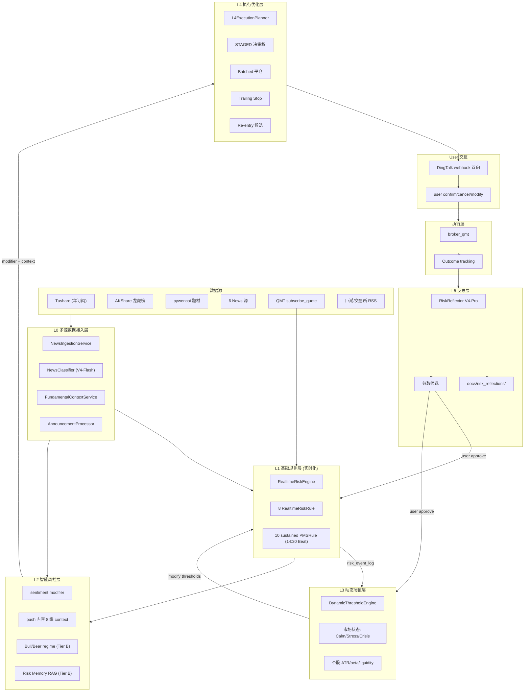
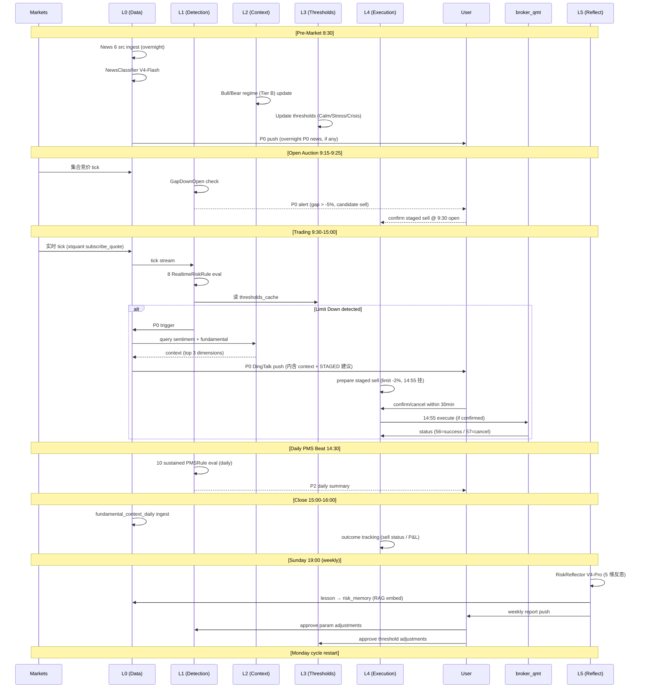

# QuantMind V3 风控架构设计文档

**Version**: 1.0 (initial draft)
**Date**: 2026-05-01
**Author**: Claude (Anthropic) + Stanleytu
**Status**: Draft — 待 user review + 决议
**Source**: 沿用 4-29 D5-D9 决议 + 4-29 PT 暂停清仓事件 + sprint period 治理基础设施 6 块基石
**License**: 内部设计文档, 非公开

---

## 文档导航

- [§0 设计动机](#§0-设计动机)
- [§1 核心设计原则](#§1-核心设计原则)
- [§2 整体架构](#§2-整体架构)
- [§3 L0 多源数据接入层](#§3-l0-多源数据接入层)
- [§4 L1 基础规则层 (实时化)](#§4-l1-基础规则层-实时化)
- [§5 L2 智能风控层](#§5-l2-智能风控层)
- [§6 L3 动态阈值层](#§6-l3-动态阈值层)
- [§7 L4 执行优化层](#§7-l4-执行优化层)
- [§8 L5 反思闭环层](#§8-l5-反思闭环层)
- [§9 端到端闭环数据流 + 24h cycle](#§9-端到端闭环数据流--24h-cycle)
- [§10 数据库 schema 设计](#§10-数据库-schema-设计)
- [§11 接口契约 + 模块边界](#§11-接口契约--模块边界)
- [§12 实施路径 (Tier A → Tier B)](#§12-实施路径-tier-a--tier-b)
- [§13 监控 + 告警 + SLA + 元监控](#§13-监控--告警--sla--元监控)
- [§14 失败模式分析 + 灾备](#§14-失败模式分析--灾备)
- [§15 测试策略](#§15-测试策略)
- [§16 性能 + 资源 budget](#§16-性能--资源-budget)
- [§17 安全 + 边界 + 金保护](#§17-安全--边界--金保护)
- [§18 ADR 清单 + 关联文档](#§18-adr-清单--关联文档)
- [§19 Roadmap (12 月)](#§19-roadmap-12-月)
- [§20 开放问题 + 待 user 决议](#§20-开放问题--待-user-决议)

---

## §0 设计动机

### §0.1 4-29 PT 暂停清仓事件 (设计起点)

**真账户 ground truth**: 17 持仓 → 0 持仓 + ¥993,520.16 cash. 4-30 14:54 xtquant 实测.

**事件 narrative v4 hybrid** (PR #169 沉淀):
- 17 股 CC 4-29 10:43:54 `emergency_close_all_positions.py` 实战 sell via QMT API (status=56 全成)
- 1 股 (688121.SH 卓然新能 4500 股) 4-29 跌停撮合规则 cancel (status=57 + error_id=-61) → 4-30 跌停解除后 user QMT GUI 手工 sell

**user 4-29 痛点 (当前文档起点)**:
- 盘中盯盘看着多只个股跌停, **现风控规则一条都没拦住**
- 现告警延迟 (14:30 daily Beat), critical event 已发生才知道
- 没有自动减仓候选 (auto_sell_l4 default=False), 只能手工 emergency_close
- 即使手工 emergency_close, 跌停板也无法卖 (1 股 688121 cancel 教训)

### §0.2 现状诊断

| 维度 | 现状 | 问题 |
|---|---|---|
| 触发频率 | 14:30 daily Beat + intraday `*/5 9-14` (5min) | **不够**: 跌停秒级事件 vs 5min 间隔 |
| 触发条件 | PMS L1 (浮盈 30%+ 回撤 15%) | **脱离市场**: 单日 -10% 跌停远低于规则触发 |
| 数据源 | 仅 QMT 持仓 + klines | **缺**: News / sentiment / fundamental_context / 公告流 / 实时行情 |
| 决策权 | 0 自动 sell, 仅告警 | **断点**: user 看到告警后还需 QMT 手输, 慢 + panic 误操作风险 |
| 复盘 | 无系统反思 | **缺**: 同类错误重复犯, 0 系统记忆 |

### §0.3 设计 hypothesis

风控系统的目的**不是**阻止亏损 (市场有自身规律, 任何系统都不可能 100% 拦截), 而是:

1. **让 user 在 critical window 内有 actionable 信息** — 跌停发生 5s 内 push, 不是 7min 后 daily check
2. **减少 user 在 panic 时刻的操作量** — 从手工 emergency_close 17 股 (高错率) → 1 click 确认 staged sell 单
3. **累积复盘形成系统记忆** — 同类错误第 N 次发生时, 系统主动 push "上次类似情况 X 做 Y, 结果 Z, 建议 W"
4. **保持 user 最终决策权** — 自动准备 + 半自动执行, 不全自动 (失控 + T+1 不可逆)

### §0.4 设计目标

**端到端闭环**: 数据接入 → detection → context → decision → execution → outcome → reflection → 参数调整 → 下一 cycle. **闭环不止于 alert, 至于 lesson learned 反馈到下一 cycle**.

**实时性优先**: 秒级 detection / 分钟级 alert + context / 30min 决策窗口 / 周月级反思.

**决策权边界清晰**: L0/L1/L2/L3 自动. L4 半自动 (STAGED 默认 + 反向决策权). L5 半自动 (push + user approve). 金 sell 单 default STAGED, OFF fallback, AUTO 仅极端.

**失败安全**: 任一组件失败不阻断核心 risk path. fail-open 默认 (alert 仍发, 仅缺 context).

**可观测 + 可复盘**: 每个事件全链路 trace + lesson 沉淀 + 元监控 (监控风控系统自身).

---

## §1 核心设计原则

### §1.1 反 4 个 anti-pattern (sprint period 沉淀)

沿用 ADR-022 + sprint period 治理基础设施 6 块基石实证教训:

| Anti-pattern | 反对方式 |
|---|---|
| 凭空 enumerate | 设计基于 4-29 痛点 + 借鉴 SSOT (4-29 D5-D9 决议 5+1 层 + Tier A/B + daily_stock_analysis 29.5K ⭐ MIT) |
| Sprint period treadmill | ADR-022 集中机制, 本文档**不再走 IRONLAWS §22 audit log entry** |
| "留 Step 7+" 滥用 | 本文档 enumerate 全部决议 + 全部失败模式 + 全部边缘 case |
| 凭空削减 user 决议 | 5+1 层全做 + Tier A/B 全做, 不擅自降级 L2/L5 到不实施 |

### §1.2 决策权边界 (3 层)

```
┌─────────────────────────────────────────────────────────┐
│ Layer 1: 全自动 (L0/L1/L2/L3)                          │
│   - 数据接入 / 触发 detection / 计算 context / 调整阈值 │
│   - 0 user 操作                                         │
│   - 0 金交易                                          │
└─────────────────────────────────────────────────────────┘
                         ↓
┌─────────────────────────────────────────────────────────┐
│ Layer 2: 半自动 (L4)                                    │
│   - 系统准备 sell 单 + push                            │
│   - User 反向决策权 (default 执行 + 30min cancel 窗口)  │
│   - 金 sell 走 STAGED 默认 / OFF fallback / AUTO 极端 │
└─────────────────────────────────────────────────────────┘
                         ↓
┌─────────────────────────────────────────────────────────┐
│ Layer 3: 半自动 (L5)                                    │
│   - 周/月反思 push + 候选参数调整                       │
│   - User approve → .env 更新 + commit                   │
│   - 0 自动 .env 改动 (沿用 ADR-022 反 anti-pattern)     │
└─────────────────────────────────────────────────────────┘
```

**金保护硬锁** (不动):
- `LIVE_TRADING_DISABLED=true` 默认
- `DINGTALK_ALERTS_ENABLED=false` 默认 (生产开 true)
- L4 AUTO 模式额外锁: 仅 Crisis regime + portfolio < -5% + user 显式 .env 启用

### §1.3 时间窗口设计 (A 股市场结构反推)

| 时段 | 时间 | 风控 cadence | 主责组件 | critical? |
|---|---|---|---|---|
| **盘前** | 8:30-9:15 | 1 次 8:30 | L0 News overnight + L2 regime | 是 (overnight gap 决策) |
| **集合竞价** | 9:15-9:25 | 实时 + 9:25 final | L1 GapDownOpen + L2 fundamental | **是** (open 前最后机会) |
| **盘中** | 9:30-11:30 / 13:00-14:55 | tick + 5min + 15min | L1 全部 RealtimeRiskRule + L3 dynamic | 是 (跌停 detection critical) |
| **尾盘** | 14:55-15:00 | 实时 + 14:55 final batch | L4 STAGED execute + Trailing | **是** (T+1 限制下最后 sell 窗口) |
| **盘后** | 15:00-16:00 | 1 次 15:30 | L1 daily PMS Beat | 中 (复盘 + 次日决策) |
| **夜间** | 16:00-8:30 next day | 1 次 16:30 + 周末报告 | L5 RiskReflector + 公告流 | 中 (反思 + overnight news) |

**critical windows 定义**: 集合竞价 (9:15-9:25) + 尾盘 (14:55-15:00) + 跌停板撬开瞬间 (任意时刻 detect).

### §1.4 完整性 vs 简洁性

5+1 层全做, 但 Tier A 优先 (4-29 痛点直接相关). L2/L5 中长期 ROI, Tier B 但本文档**enumerate 完整** (避免 sprint period 后续凭空 enumerate).

**不削减原因**: user 4-29 决议是完整方案. 削减 = 凭空否定 user 决议. 完整 enumerate 后, 实施层时序拆分 (Tier A vs B), 但**设计层 0 削减**.

---

## §2 整体架构

### §2.1 5+1 层数据流图



### §2.2 Tier A/B 时序

**Tier A (T1.5 前完成, 沿用 4-29 决议 + 本设计补充)**:

1. LiteLLM 接入 (基础设施, 0 业务逻辑)
2. L0.1 News 6 源接入
3. L0.2 NewsClassifier V4-Flash
4. L0.3 fundamental_context 8 维 schema
5. L0.4 公告流处理
6. L0.5 fail-open 设计
7. **L1 实时化** (本设计新增到 Tier A — 4-29 痛点 critical)
8. **L1 8 RealtimeRiskRule 扩展** (本设计新增)
9. L0 告警实时化 (3 级 + push cadence)
10. L3 dynamic threshold (实时阈值, 非 vol-targeting)
11. **L4 STAGED 决策权** (本设计新增到 Tier A — 4-29 痛点 critical)
12. L4 Batched 平仓
13. L4 Trailing Stop (替代静态 PMSRule v1)
14. L4 Re-entry 候选

**Tier B (T2, T1.5 之后)**:

15. L2 Bull/Bear regime detection (2-Agent debate, 借 QuantDinger)
16. L2 Risk Memory RAG (借 daily_stock_analysis qd_analysis_memory)
17. L5 RiskReflector (5 维反思, 借 TradingAgents 5 Agent)

**不实施** (沿用 4-29 决议):

- jin-ce-zhi-suan (商业授权, 仅借鉴架构思想)
- QuantDinger 7-Agent 全实施 (仅借 Memory-Augmented + Bull/Bear 2-Agent)
- LangGraph (over-engineering)
- 多渠道推送 (DingTalk 单源够用)
- Vibe Coding NL→Strategy (与 GP+LLM 因子生成路径冲突)

### §2.3 闭环路径 (端到端关键)

```
[N day]
   ↓
   data ingestion (L0)
   ↓
   detection (L1) + dynamic thresholds (L3)
   ↓
   sentiment + context (L2)
   ↓
   alert + push (L0 告警)
   ↓
   execution plan (L4)
   ↓
   user decision (DingTalk 双向)
   ↓
   broker_qmt 实施
   ↓
   outcome tracking (sell 单 status / P&L / event_log)
   ↓
   [Sunday 19:00 + monthly + post-event]
   ↓
   L5 RiskReflector (5 维反思)
   ↓
   lesson → risk_memory (RAG)
   ↓
   参数候选 push → user approve
   ↓
   .env 更新 + commit
   ↓
[N+1 day] L1/L3 阈值更新 → 下一 cycle
```

闭环**至于 lesson learned 反馈到下一 cycle**, 不止于 alert. 这是 V3 vs 现 V2 的核心差异.

---

## §3 L0 多源数据接入层

**目标**: 提供 L1 detection 之外的所有 contextual data — News / sentiment / fundamental / 公告 / 实时行情. 让 detection 不孤立, 决策有依据.

**4-29 决议依据**: D5-D9 拍板, 借 daily_stock_analysis (29.5K ⭐ MIT) 6 维设计.

### §3.1 News 多源接入 (L0.1)

**6 源清单** (5-02 换源决议沿用, 详 [ADR-033](adr/ADR-033-news-source-replacement-decision.md)):

| 源 | 类型 | 用途 | API 限速策略 |
|---|---|---|---|
| **智谱 GLM-4.7-Flash** | 中文 LLM 接入 + 联网搜索 | News#1 fetcher 主源 (替 MiniMax, 沿用 ADR-035) | 永久免费 (~1M tokens/天) + 200K context + MCP integration + OpenAI 兼容 |
| **Tavily** | 英文 + 翻译 | 海外信号 (港美 ADR 联动, 沿用) | 1000 credits/月永久免费 + LiteLLM 限速 fallback |
| **Anspire** | 中文财经 | 中文财经主源 (沿用) | 新户 2500 点 + LiteLLM 多 Key 负载均衡 |
| **GDELT 2.0** | 全球事件 | 跨境 + 突发 (替 Bocha) | 0 API key + 完全免费 + 7×24 实时 stream |
| **Marketaux** | 金融专用 | 金融信号 + sentiment 标签 (替 SerpAPI) | 5000+ sources / 30+ languages + 完全免费 (100 req/day) + sentiment pre-tagged (沿用 ADR-035 5-06 cite drift 修订) |
| **RSSHub 自部署** | 中文财经 RSS | 长尾 + 全主流源 (替 Brave) | 自部署 + 0 API key + 0 第三方依赖 |

**砍源 4 个** (5-02 web_search 验证后决议): Serper / DuckDuckGo / Bocha / Alpha Vantage. 详 [ADR-033 §3 Rationale](adr/ADR-033-news-source-replacement-decision.md).

**月成本**: $0/month (全 6 源完全免费层. Tavily 1000 credits/月永久 + Anspire 新户 2500 点沿用 (申请即时 reactjs, 反 5-02 cite "审批 1-2 周") + 智谱 GLM-4.7-Flash 永久免费 (~1M tokens/天, 沿用 ADR-035) + GDELT 0 API key + Marketaux 100 req/day + RSSHub 自部署).

**策略**: 并行查询 + 早返回. 任 3 源命中即继续 (full timeout 30s 全等待不可接受).

**LiteLLM 接入** (沿用 4-29 ADR-020): 单 Key 限速 fallback + 多 Key 负载均衡 + retry exponential backoff.

**存储**:

```sql
CREATE TABLE news_raw (
    news_id BIGSERIAL PRIMARY KEY,
    symbol_id VARCHAR(20),  -- NULL = 大盘/行业 news
    source VARCHAR(20) NOT NULL,
    timestamp TIMESTAMPTZ NOT NULL,
    title TEXT NOT NULL,
    content TEXT,
    url TEXT,
    lang VARCHAR(10) DEFAULT 'zh',
    fetch_cost NUMERIC(8, 4),  -- USD
    fetch_latency_ms INT,
    fetched_at TIMESTAMPTZ DEFAULT NOW()
);

SELECT create_hypertable('news_raw', 'fetched_at', chunk_time_interval => INTERVAL '1 day');
CREATE INDEX idx_news_raw_symbol_time ON news_raw (symbol_id, timestamp DESC);
CREATE INDEX idx_news_raw_source_time ON news_raw (source, fetched_at DESC);

-- 90 day TTL (TimescaleDB compression after 7 day)
SELECT add_compression_policy('news_raw', INTERVAL '7 days');
SELECT add_retention_policy('news_raw', INTERVAL '90 days');
```

### §3.2 NewsClassifier V4-Flash (L0.2)

**输入**: news_raw 单行
**输出**: news_classified

```sql
CREATE TABLE news_classified (
    news_id BIGINT PRIMARY KEY REFERENCES news_raw(news_id),
    sentiment_score NUMERIC(5, 4) NOT NULL,  -- [-1, 1]
    category VARCHAR(20) NOT NULL,  -- 利好/利空/中性/事件驱动
    urgency VARCHAR(4) NOT NULL,  -- P0/P1/P2/P3
    confidence NUMERIC(5, 4) NOT NULL,  -- [0, 1]
    profile VARCHAR(20) NOT NULL,  -- ultra_short/short/medium/long
    classifier_model VARCHAR(50) NOT NULL,
    classifier_prompt_version VARCHAR(10) NOT NULL,
    classifier_cost NUMERIC(8, 4),
    classified_at TIMESTAMPTZ DEFAULT NOW()
);
```

**NEWS_STRATEGY_PROFILE 4 档** (借 daily_stock_analysis):

| Profile | 时效 | 触发响应 | 例子 |
|---|---|---|---|
| **ultra_short** | intraday | P0 push | 突发停牌 / 跌停瞬间 news / 监管处罚 |
| **short** | 1-5 day | P1 决策辅助 | 业绩快报 / 重大合同 / 减持公告 |
| **medium** | 1-4 week | P2 持仓调整候选 | 行业政策 / 竞争格局变化 |
| **long** | 1Q+ | P3 因子层信号 | 战略转型 / 长期基本面 |

**Prompt 沉淀**:
```
prompts/risk/news_classifier_v1.yaml
```

版本可迭代, 走 git diff. ADR 记录大版本变更.

### §3.3 fundamental_context 8 维 schema (L0.3)

借 daily_stock_analysis 8 维 (重命名对齐 A 股):

```sql
CREATE TABLE fundamental_context_daily (
    symbol_id VARCHAR(20) NOT NULL,
    date DATE NOT NULL,
    valuation JSONB,        -- {pe, pb, ps, ev_ebitda, industry_pctile}
    growth JSONB,           -- {revenue_yoy, profit_yoy, eps_3y_cagr}
    earnings JSONB,         -- {roe, roa, gross_margin, ocf_to_profit, mismatch_flag}
    institution JSONB,      -- {fund_holding_pct, private_pct, northbound_pct, top10_change}
    capital_flow JSONB,     -- {main_5d, main_10d, main_20d, northbound_buy_sell}
    dragon_tiger JSONB,     -- {count_30d, net_buy, top_seats}
    boards JSONB,           -- {concept_themes, limit_up_days, board_height}
    announcements JSONB,    -- {recent_count, types, urgency_max}
    PRIMARY KEY (symbol_id, date)
);

SELECT create_hypertable('fundamental_context_daily', 'date', chunk_time_interval => INTERVAL '1 month');
SELECT add_retention_policy('fundamental_context_daily', INTERVAL '2 years');
```

**数据源映射**:
- valuation / growth / earnings → Tushare `daily_basic` + `fina_indicator`
- institution → Tushare `top10_holders` + `hk_hold` (北向)
- capital_flow → Tushare `moneyflow` + 北向
- dragon_tiger → AKShare 龙虎榜
- boards → pywencai 题材
- announcements → 巨潮 RSS + Tushare `disclosure_date`

**更新 cadence**: 每日 16:00 (盘后入库). 实时 boards/announcements 由 L0.4 处理.

### §3.4 公告流处理 (L0.4)

**实时订阅**: 巨潮资讯 RSS + 上交所/深交所 RSS. cadence: 每 5min poll (盘中) + 每小时 (盘后).

**关键公告分类** (P0 直 push):
- 停牌 / 复牌
- 立案调查
- 业绩预亏 (对比预期)
- 减持公告 (大股东 / 实控人)
- 重大事项 (并购 / 出售 / 重组)

**其他公告** (入 news_classified pipeline):
- 业绩快报 / 中报 / 年报
- 增持 / 回购
- 高管变动
- 股权激励

**存储**: 复用 `news_raw` 表 (source = "announcement_cninfo" / "announcement_sse" / etc).

### §3.5 fail-open 设计 (L0.5)

**核心原则**: L0 任一源失败**不阻断** L1-L5 核心 risk path.

**fail-open 行为**:
- News 6 源全 timeout → alert 仍发, push 内容仅缺 sentiment/news context
- fundamental_context 缺失 → 用上一日数据 (degrade) + 标 stale flag
- 公告流 RSS 失败 → 告警元监控, 但不阻 detection

**监控**:

```sql
CREATE TABLE risk_data_gap_log (
    gap_id BIGSERIAL PRIMARY KEY,
    component VARCHAR(50) NOT NULL,  -- news_anspire/fundamental_context/announcement_cninfo
    gap_start TIMESTAMPTZ NOT NULL,
    gap_end TIMESTAMPTZ,  -- NULL = ongoing
    error_type VARCHAR(50),
    error_message TEXT,
    impact_severity VARCHAR(4),  -- P0/P1/P2/P3
    detected_at TIMESTAMPTZ DEFAULT NOW()
);
```

**Gap > N min → 元告警**: P0 component (news 全失败) 5min → DingTalk push. P2 component (单源失败) 30min → 仅 log.

---

## §4 L1 基础规则层 (实时化)

**目标**: 秒级跌停 / 接近跌停 / 快速下跌 detection. 替代现 5min Beat 的核心改造.

**4-29 决议依据**: 沿用 ADR-010 PMSRule + MVP 3.1b 接口, 实时化升级.

### §4.1 现有规则 (~10 PMSRule)

| 规则 | 触发条件 | cadence | 不动? |
|---|---|---|---|
| PMSRule L1 | 浮盈 > 30% + 回撤 > 15% | 14:30 daily | ✅ |
| PMSRule L2 | 浮盈 > 20% + 回撤 > 12% | 14:30 daily | ✅ |
| PMSRule L3 | 浮盈 > 10% + 回撤 > 10% | 14:30 daily | ✅ |
| SingleStockStopLoss | 单股 -7% | 14:30 daily | ⚠️ 升级到实时 (本设计) |
| IntradayDrawdown | portfolio intraday < -5% | 14:30 daily | ⚠️ 升级到实时 (本设计) |
| CorrelatedLossClump | N 股同时下跌 | 14:30 daily | ⚠️ 升级到实时 (本设计) |

L1 接口 (RiskRule abstract), 不动. 仅替换 cadence + 新增子类.

### §4.2 实时化升级 (subscribe_quote 接入)

**数据源**:

```python
# scripts/realtime_risk_subscriber.py (新增)
from xtquant import xtdata

def subscribe_realtime(symbols: list[str], callback):
    """订阅实时 tick 推送."""
    for s in symbols:
        xtdata.subscribe_quote(
            stock_code=s,
            period='tick',
            count=-1,  # 实时
            callback=callback,
        )

# qmt_data_service 缩短同步周期: 60s → 5s (Redis cache)
# - portfolio:current Hash (Redis): 5s 同步
# - market:latest:{code} TTL=10s (Redis)
```

**新增 cadence**:

| 级别 | 间隔 | 触发场景 |
|---|---|---|
| Tick | 实时 (秒级) | 跌停 / 接近跌停 / 流动性骤降 |
| 5min | 5min | 快速下跌 / 异动放量 |
| 15min | 15min | 中期趋势 |
| 14:30 daily | 1/day | PMSRule (不动) |

### §4.3 8 RealtimeRiskRule (新增, 完整 enumerate)

| Rule | 触发条件 | 优先级 | 决策候选 |
|---|---|---|---|
| **LimitDownDetection** | 跌幅 = 涨跌停限制 ±0.01% | P0 | alert only (跌停板无买盘, 不挂 sell, 沿用 4-29 688121 教训) |
| **NearLimitDown** | 跌幅 > 9.5% (主板) / > 19.5% (科创/创业) | P0 | alert + 准备尾盘 sell 单 (限价 -2%) |
| **RapidDrop5min** | 5min 跌幅 > 5% | P1 | alert + L2 sentiment 关联查询 |
| **RapidDrop15min** | 15min 跌幅 > 8% | P1 | alert + 候选 staged sell |
| **VolumeSpike** | 5min vol > 20day avg × 3 | P1 | alert + capital_flow 查询 |
| **IndustryConcentration** | 单行业暴露 > 30% | P2 | alert (avoid 4-29 多股同时跌停) |
| **CorrelatedDrop** | 持仓 N 股同时下跌 (5min 内 ≥ 3 股 > -3%) | P0 | alert + Crisis regime 候选 |
| **LiquidityCollapse** | 持仓股 day vol < 20day avg × 0.3 | P1 | alert (出货风险) |
| **GapDownOpen** | 集合竞价跳空 > -5% | P0 | 9:25 开盘前 alert + 候选 9:30 sell |

### §4.4 参数 .env 化

所有阈值 `.env` 可调, 走 `config_guard` 启动硬 raise (沿用铁律 34):

```bash
# .env (新增)
RT_LIMIT_DOWN_THRESHOLD_MAIN=0.099    # 主板 9.9%
RT_LIMIT_DOWN_THRESHOLD_STAR=0.198    # 科创/创业 19.8%
RT_NEAR_LIMIT_DOWN_THRESHOLD=0.095    # 跌停前预警 9.5%
RT_RAPID_DROP_5MIN=0.05
RT_RAPID_DROP_15MIN=0.08
RT_VOLUME_SPIKE_RATIO=3.0
RT_INDUSTRY_CONCENTRATION_LIMIT=0.30
RT_CORRELATED_DROP_COUNT=3
RT_CORRELATED_DROP_THRESHOLD=0.03
RT_LIQUIDITY_DROP_RATIO=0.30
RT_GAP_DOWN_THRESHOLD=0.05
RT_DETECTION_LATENCY_SLA_MS=5000
```

`config_guard` 启动检查所有 RT_* 字段存在 + 类型正确. 缺失 → fail-loud + service 不启动.

### §4.5 集成 (新模块)

**`RealtimeRiskEngine`** (新建, 现 RiskEngine 子类):
- 异步 worker (Celery solo pool 或独立 supervisor process)
- 订阅 xtquant tick + 5min/15min Beat
- 评估 8 RealtimeRiskRule + 10 PMSRule
- 触发 → INSERT risk_event_log + 调 L0 告警实时化

**risk_event_log 字段扩展** (schema + 新字段):

```sql
ALTER TABLE risk_event_log ADD COLUMN cadence VARCHAR(20);  -- tick/5min/15min/daily
ALTER TABLE risk_event_log ADD COLUMN priority VARCHAR(4);  -- P0/P1/P2
ALTER TABLE risk_event_log ADD COLUMN realtime_metrics JSONB;  -- 触发时刻的 tick/vol/etc
ALTER TABLE risk_event_log ADD COLUMN detection_latency_ms INT;
```

**L0 告警实时化** (3 级 + push cadence):

| 优先级 | cadence | 推送方式 |
|---|---|---|
| **P0** (秒级) | 立即 (< 5s) | DingTalk @ user 直推 |
| **P1** (分钟级) | 1min batch | DingTalk batch push (避免抖动) |
| **P2** (日终) | 14:30 daily | 沿用现 daily check |

**push 内容标准化**:
```
🚨 [P0] {symbol} {price} (-{drop_pct}%) 接近跌停
🔍 context (来自 L2):
  - PE 35x (行业 75%ile 高估)
  - 主力 5d -2.3 亿
  - 公募 Q3 -15% 减持
  - 龙虎榜 3 day 内 2 次游资席位
💡 建议: STAGED sell @ {limit_price} (限价 -2%)
[确认 sell] [改量] [取消] [忽略]
```

`L0 push` 含足够信息, user 不需要去 QMT 查.

---

## §5 L2 智能风控层

**目标**: sentiment / fundamental_context 修饰 L1 detection + 决策辅助 push 内容. Tier B 加 Bull/Bear regime + RAG.

**4-29 决议依据**: D7 拍板. 借 QuantDinger Memory-Augmented + daily_stock_analysis 8 维 + TradingAgents 反思模式.

### §5.1 sentiment modifier (Tier A)

**集成方式**: L0.2 NewsClassifier 输出 sentiment_score → 加权聚合到个股 24h sentiment.

```python
# 个股 24h sentiment 计算
sentiment_24h = sum(
    news.sentiment_score
    * source_weight[news.source]
    * time_decay(news.timestamp, now)
    for news in last_24h_news[symbol]
) / total_weight
```

**source_weight**: 起步等权 (1.0 各源). 后续 L5 反思根据"sentiment 提前预测准确率"自学习调整.

**time_decay**: exp(-(now - timestamp) / 6h), 6h 半衰期.

**集成到 L1**: NearLimitDown + sentiment_24h < -0.3 → upgrade P1 → P0. sentiment 是 risk modifier, 不独立触发.

### §5.2 fundamental_context 决策辅助 (Tier A)

L1 触发 P0/P1 alert 时, push 内容含 fundamental_context 8 维 top 3 最相关维度 + 1 句解读.

**V4-Flash 选维度 prompt**:
```
prompts/risk/context_summarizer_v1.yaml
```

输入: L1 alert + 8 维 fundamental_context + sentiment_24h
输出: top 3 维度 + 1 句解读 + STAGED 建议

**示例输出**:
```
context: 估值 PE 35x (高估) / 资金 主力 -2.3 亿 / 机构 Q3 -15% 减持
解读: 高估 + 资金离场 + 机构减持三重信号
建议: STAGED sell (尾盘 14:55, 限价 -2%)
```

### §5.3 Bull/Bear regime detection (Tier B)

借 QuantDinger Bull vs Bear debate 模式, **不全实施 7 Agent**, 仅 2 Agent debate:

```
prompts/risk/bull_agent_v1.yaml
prompts/risk/bear_agent_v1.yaml
prompts/risk/regime_judge_v1.yaml (V4-Pro)
```

**输入**: 上证指数 / 沪深 300 + 板块涨跌家数 + 北向资金 + 50ETF 期权 IV (恐慌指数 proxy)

**Bull Agent**: 找 3 条看多论据 (V4-Pro, 沿用 ADR-036 debate reasoning capability)
**Bear Agent**: 找 3 条看空论据 (V4-Pro, 沿用 ADR-036 debate reasoning capability)
**Judge**: V4-Pro 对 6 论据加权 → 输出 regime {Bull / Bear / Neutral / Transitioning} + confidence + reasoning

**cadence**: 每日 9:00 + 14:30 + 16:00, 3 次更新.

**存储**:

```sql
CREATE TABLE market_regime_log (
    regime_id BIGSERIAL PRIMARY KEY,
    timestamp TIMESTAMPTZ NOT NULL,
    regime VARCHAR(20) NOT NULL,  -- Bull/Bear/Neutral/Transitioning
    confidence NUMERIC(5, 4) NOT NULL,
    bull_arguments JSONB,
    bear_arguments JSONB,
    judge_reasoning TEXT,
    market_indicators JSONB,  -- 输入快照
    cost NUMERIC(8, 4),
    created_at TIMESTAMPTZ DEFAULT NOW()
);
SELECT create_hypertable('market_regime_log', 'timestamp', chunk_time_interval => INTERVAL '1 month');
```

**风控应用** (集成到 L3):
- regime = Bear → L1 阈值收紧 (e.g. RT_RAPID_DROP_5MIN 5% → 4%)
- regime = Bull → 阈值放松 (5% → 6%)
- regime change → 每日 push user 确认调整 (不全自动)

### §5.4 Risk Memory RAG (Tier B)

借 daily_stock_analysis qd_analysis_memory + QuantDinger Memory-Augmented:

```sql
CREATE TABLE risk_memory (
    memory_id BIGSERIAL PRIMARY KEY,
    event_type VARCHAR(50) NOT NULL,  -- LimitDown/RapidDrop/IndustryCorrelated/etc
    symbol_id VARCHAR(20),
    event_timestamp TIMESTAMPTZ NOT NULL,
    context_snapshot JSONB NOT NULL,  -- 触发时刻的 L0/L1/L2 完整 snapshot
    action_taken VARCHAR(50),  -- STAGED_executed/STAGED_cancelled/manual_sell/no_action
    outcome JSONB,  -- {1d_pnl, 5d_pnl, 30d_pnl, retrospective_correctness}
    lesson TEXT,
    embedding VECTOR(1024),  -- pgvector
    created_at TIMESTAMPTZ DEFAULT NOW()
);
CREATE INDEX idx_risk_memory_embedding ON risk_memory USING ivfflat (embedding vector_cosine_ops);
CREATE INDEX idx_risk_memory_event_type ON risk_memory (event_type, event_timestamp DESC);
```

**Retrieval**: L1 触发时, vector similarity search 历史相似事件 → push 内容含 "类似情况 N 次, 做 X 动作, 平均结果 Y".

**embedding 模型** (待 user 决议, §20 #3):
- 选项 A: BGE-M3 (本地, 0 cost, 1024 维, 中文优化)
- 选项 B: LiteLLM API (V4-Flash embedding, ~$0.0001/1k tokens, 易接入)

**vector store**: pgvector (TimescaleDB 同 PG, 0 新依赖). 已验证.

### §5.5 V4-Flash vs V4-Pro 路由 (沿用 4-29 ADR-020)

| 任务 | 模型 | 频率 | 月成本估算 |
|---|---|---|---|
| L0.2 NewsClassifier | V4-Flash | 每日 100-300 calls | $0.05-0.15/天 |
| L2.2 fundamental_context summarizer | V4-Flash | 每 alert 1 call (~10/day) | $0.02/天 |
| L2.3 Bull Agent / Bear Agent | V4-Pro (ADR-036) | 每日 6 calls | ~$0.013/天 (full price) / ~$0.003/天 (75% discount 走 2026-05-31) |
| L2.3 Judge | V4-Pro | 每日 3 calls | $1/天 |
| L5 RiskReflector | V4-Pro | 周 1 + 月 1 + post-event | $5-10/月 |
| Embedding (RAG ingest) | ~~V4-Flash~~ **BGE-M3 本地** | 每 risk_event 1 call | ~~$0.01/事件~~ **$0** |
| 灾备 fallback | Ollama 本地 | LiteLLM 全 timeout 时 | $0 |

> **2026-05-14 标注 (TB-5c, ADR-071 / ADR-069 D3)**: Embedding (RAG ingest) 实为 **BGE-M3 本地 1024-dim** (ADR-064 D2 + ADR-068 D2 lock) — NOT V4-Flash API. 0 LLM cost (本地推理). 本设计期 "V4-Flash embedding" cite 是 pre-ADR-064 spec drift. Append-only 标注, sustained ADR-022.

**总月预算**: $20-50 (Tier A ~$10/月, Tier B 加 ~$30-40/月).

`LiteLLMRouter` (新模块) 强制走 LiteLLM, CI lint 禁 `import anthropic` (沿用 4-29 ADR-020 决议, 待写).

---

## §6 L3 动态阈值层

**目标**: 实时市场状态 + 个股状态 + 行业联动反馈到 L1 阈值. 让 L1 detection 不是静态死规则, 是 regime-aware.

**4-29 决议依据**: D7 "动态阈值层". 注意: **不是** Vol-Targeting / Drawdown-Aware (memory NO-GO 沿用), 是**实时阈值动态调整**.

### §6.1 实时市场状态阈值

**输入**: L2.3 regime + 盘中市场指标 (上证指数 day return / 跌停家数 / 北向流向)

**3 级状态**:

| 状态 | 触发条件 | L1 阈值调整 |
|---|---|---|
| **Calm** | regime=Neutral + 大盘 ±1% 内 | 沿用 .env 静态值 |
| **Stress** | regime=Bear OR 大盘 -2% OR 跌停家数 > 50 | L1 阈值 × 0.8 (更敏感) |
| **Crisis** | 大盘 -5% OR 跌停家数 > 200 OR 千股跌停 | L1 阈值 × 0.5 (高敏感) + L4 自动 STAGED 模式 |

**cadence**: 5min 评估一次 + 重大事件触发 (跳变 detect, e.g. 大盘 5min 内从 -1% 跌到 -3%, 立即升级 Stress).

### §6.2 个股动态阈值

**输入**: 个股 ATR (20day) / beta (CSI300) / liquidity 分位

**调整**:
- 高 beta 股 (β > 1.5) RT_RAPID_DROP_5MIN × 1.2 (更难触发, 减误报, 高 beta 本身波动大)
- 低 liquidity 股 (vol 分位 < 20%) RT_LIQUIDITY_DROP_RATIO × 1.5 (更敏感)
- 高 ATR 股 (ATR/price > 5%) RT_RAPID_DROP_5MIN × 1.5 (更难触发)

### §6.3 Concept / Industry 联动阈值

**输入**: 持仓股所属 SW1 行业 + 概念板块当日涨跌

**调整**: 持仓 N 股同行业 + 行业 day -3% → CorrelatedDrop 阈值 from 3 股 → 2 股 (更早触发).

### §6.4 实施

**`DynamicThresholdEngine`** (新建): 5min Beat 更新 thresholds_cache (Redis), L1 RealtimeRiskRule 读 cache 替代 .env 静态值.

```sql
-- thresholds_cache 用 Redis (低延迟读, L1 每 tick 都读)
-- Redis Key: risk:thresholds:{symbol_id} (Hash)
-- Fields: rt_rapid_drop_5min / rt_liquidity_drop_ratio / etc
-- TTL: 5min (与 Beat 同步, fallback 静态 .env)
```

**.env override** (debug + fail-safe):

```bash
DYNAMIC_THRESHOLDS_ENABLED=true|false  # default true, debug 设 false 用静态
DYNAMIC_THRESHOLDS_LOG_LEVEL=DEBUG  # 记录每次调整的 reason
```

**记录**:

```sql
CREATE TABLE dynamic_threshold_adjustments (
    adjustment_id BIGSERIAL PRIMARY KEY,
    timestamp TIMESTAMPTZ NOT NULL,
    symbol_id VARCHAR(20),  -- NULL = 大盘
    state VARCHAR(20) NOT NULL,  -- Calm/Stress/Crisis
    threshold_key VARCHAR(50) NOT NULL,
    static_value NUMERIC(10, 6),
    adjusted_value NUMERIC(10, 6),
    adjustment_reason TEXT,
    market_indicators JSONB,
    created_at TIMESTAMPTZ DEFAULT NOW()
);
SELECT create_hypertable('dynamic_threshold_adjustments', 'timestamp', chunk_time_interval => INTERVAL '1 day');
SELECT add_retention_policy('dynamic_threshold_adjustments', INTERVAL '180 days');
```

---

## §7 L4 执行优化层

**目标**: STAGED 决策权 + Batched + Trailing + Re-entry. 解决 4-29 痛点 #3 (没有自动减仓候选, 全手工 emergency_close).

**4-29 决议依据**: D8 拍板.

### §7.1 STAGED 决策权 (3 档)

| 档 | 行为 | 适用 |
|---|---|---|
| **OFF** (current default) | 0 自动, 仅 alert. user 4-29 模式 | fallback |
| **STAGED** (本设计推荐 default) | 自动准备 sell 单 + push + 30min cancel 窗口 + 反向决策权 | 默认 |
| **AUTO** | 全自动, 0 confirmation | 仅极端: Crisis regime + portfolio < -5% intraday + user 显式 .env 启用 |

**STAGED 模式细节**:
1. L1 触发 P0 alert → L4 准备 sell 单 (限价 = 当前价 -2%, 尾盘 14:55 挂)
2. DingTalk push: "已挂单, 30min 内可 cancel, default 执行"
3. user 不动作 = 执行
4. user reply "cancel" = 撤单
5. user reply "modify {qty}" = 改量
6. 30min 超时 + 0 reply = 执行 (沿用反向决策权原则)

**反向决策权 vs 正向决策权论据**:
- 正向 (default 不动 + 主动确认): user 在 panic 时刻可能错过 push, alert 失效
- 反向 (default 执行 + 主动否决): user 在 panic 时刻信任系统, 错误成本 = 1-2% 滑点 (限价 -2%)
- 4-29 实测: user emergency_close 用 ~10min, STAGED 30min 窗口够

### §7.2 Batched 平仓

**触发**: L1 P0 alert (CorrelatedDrop 4+ 股 / Crisis regime / portfolio intraday < -5%).

**行为**: 不一次性全卖 (流动性冲击), 分 N 批:
- N = max(3, ceil(持仓股数 × 0.3))
- batch interval = 5min
- 每 batch 优先卖 (a) 跌幅大 (b) 流动性差 (c) sentiment 最负
- 每 batch 后重新评估: 若市场反弹 + alert 清除 → 停止后续 batch (Re-entry 候选)

### §7.3 Trailing Stop

**替代**: 现 PMSRule v1 (静态阈值) → 动态 trailing.

**逻辑**:
- 浮盈 ≥ 20% 启动 trailing
- trailing % = max(10%, ATR × 2)
- 浮盈 ≥ 50%, trailing 收紧到 ATR × 1.5
- 浮盈 ≥ 100%, trailing 收紧到 ATR × 1

**deprecation**: PMSRule v1 (静态) deprecated → ADR-016 (TIER0_REGISTRY D-M2). 现 PMSRule L1/L2/L3 短期, Tier A Sprint 8 替换.

### §7.4 Re-entry 逻辑

**追踪**: L4.2 batched 卖出后追踪 sold symbols. 若:
- 卖出价 + 5% 内反弹 (1 day 内)
- L2 sentiment_24h 转正
- L3 regime 转 Calm

→ Push "考虑 re-entry: {symbol}, 卖出价 {X}, 当前 {Y}, 建议买回 {Z} 股"

**不自动 buy back** (T+1 限制 + 失控风险). user 决策.

### §7.5 实施

**`L4ExecutionPlanner`** (新 service):
- 接 RealtimeRiskEngine 输出 → 生成 ExecutionPlan
- 输出 schema: `{symbol, action: SELL/HOLD/BATCH, qty, limit_price, batch_index, batch_total, scheduled_at, cancel_deadline}`
- 调 broker_qmt 实施 (T0-5 production-ready)

**ExecutionPlan 存储**:

```sql
CREATE TABLE execution_plans (
    plan_id UUID PRIMARY KEY DEFAULT gen_random_uuid(),
    triggered_by_event_id BIGINT REFERENCES risk_event_log(event_id),
    mode VARCHAR(20) NOT NULL,  -- OFF/STAGED/AUTO
    symbol_id VARCHAR(20) NOT NULL,
    action VARCHAR(20) NOT NULL,  -- SELL/HOLD/BATCH
    qty INT NOT NULL,
    limit_price NUMERIC(10, 4),
    batch_index INT,
    batch_total INT,
    scheduled_at TIMESTAMPTZ NOT NULL,
    cancel_deadline TIMESTAMPTZ NOT NULL,
    status VARCHAR(20) NOT NULL,  -- PENDING_CONFIRM/CONFIRMED/CANCELLED/EXECUTED/FAILED
    user_decision VARCHAR(20),  -- confirm/cancel/modify/timeout
    user_decision_at TIMESTAMPTZ,
    broker_order_id VARCHAR(50),
    broker_fill_status INT,  -- QMT status code
    created_at TIMESTAMPTZ DEFAULT NOW()
);
CREATE INDEX idx_execution_plans_status_deadline ON execution_plans (status, cancel_deadline)
    WHERE status = 'PENDING_CONFIRM';
```

**DingTalk webhook 双向通信** (新增):
- 现 dingtalk_alert helper (PR #170 c3) 仅 push, 加 webhook receiver listen reply
- user reply 解析 → 更新 execution_plans.user_decision
- 实施: FastAPI endpoint `POST /api/risk/dingtalk_callback` (DingTalk 加密签名验证)

---

## §8 L5 反思闭环层

**目标**: 周/月/事件后系统反思, lesson 沉淀到 RAG (L2.4) + 候选参数调整 push user. **闭环至于此**.

**4-29 决议依据**: D9. 借 TradingAgents 5 Agent 反思模式.

### §8.1 RiskReflector Agent

**cadence**:
- 每周日 19:00 (周复盘)
- 每月 1 日 09:00 (月复盘)
- 重大事件后 24h (e.g. 单日 portfolio < -5% / N 股同时跌停 / STAGED cancel 率异常)

**输入**: 上周期 risk_event_log + risk_memory + 实际 P&L outcome + execution_plans status.

**输出 5 维反思** (借 TradingAgents 5 Agent):

| 维度 | 反思问题 | 输出形式 |
|---|---|---|
| **Detection** | alert 是否及时? 漏报 / 误报 case? | 漏报清单 + 误报率 + 改进候选 |
| **Threshold** | 阈值是否合理? L3 dynamic adjust 是否正确? | 阈值调整候选 + 论据 |
| **Action** | STAGED cancel 率 / AUTO 触发是否事后正确? | 决策准确率 + STAGED default 是否需调 |
| **Context** | L2 sentiment / fundamental 是否提供 actionable 信息? | context 命中率 + 升级候选 |
| **Strategy** | 整体风控是否符合 user 风险偏好? | 风格漂移诊断 |

### §8.2 输出形式

每周一份 markdown report, push DingTalk 摘要 + repo 沉淀:

```
docs/risk_reflections/YYYY_WW.md
docs/risk_reflections/YYYY_MM.md
docs/risk_reflections/event/YYYY-MM-DD_<event_summary>.md
```

**摘要 push** (DingTalk):
```
📊 周复盘 W18 (2026-05-04 ~ 05-10)
事件: 12 alerts (P0 3 / P1 7 / P2 2)
准确率: 75% (9/12 事后正确)
漏报: 1 (LimitDown 002xxx 14:23 漏 5min)
误报: 2 (RapidDrop5min 触发但 15min 内反弹)
候选调整:
  - RT_RAPID_DROP_5MIN 5% → 5.5% (减误报)
  - LimitDown 增加分钟级 polling (减漏报)
完整: docs/risk_reflections/2026_W18.md
[查看完整] [approve 调整 1] [approve 调整 2] [全部 approve] [全部 reject]
```

### §8.3 闭环 (本设计核心)

**lesson → risk_memory** (RAG L2.4 同库):
- 每事件 outcome 收集后, ~~V4-Flash embedding~~ → INSERT risk_memory
  > **2026-05-14 标注 (TB-5c, ADR-071 / ADR-069 D3)**: embedding 实为 **BGE-M3 本地 1024-dim** (NOT V4-Flash API) — ADR-064 D2 + ADR-068 D2 决议 supersede 本设计期 "V4-Flash embedding" cite (pre-ADR-064 spec drift). 0 LLM cost, 中文优化. Append-only 标注, sustained ADR-022.
- 下次相似事件触发时, RAG retrieval 返回 historical lesson

**参数候选 → user approve → .env 更新**:
- 候选不自动改 .env (沿用 ADR-022 反 anti-pattern)
- user reply approve → 系统生成 PR (CC 自动 commit + push) → user merge
- user reply reject → 候选入 docs/research-kb/risk_findings/ 长尾留存

**候选规则新增 → enumerate → 走正常 PR**:
- 反思发现新规则候选 (e.g. "T+0 衍生品异动 → 现货 alert") → enumerate 进 docs/research-kb/risk_findings/
- 不立即实施, 走正常 PR 流程 (与日常因子研究同流程)

### §8.4 V4-Pro 路由

L5 用 V4-Pro (反思类需要 nuanced reasoning), 沿用 4-29 LLM 路由决议.

```
prompts/risk/reflector_v1.yaml
```

**Prompt 模板** (5 维反思各一段, 总 ~1500 tokens input + ~2000 tokens output):

```yaml
system: |
  You are RiskReflector, a quantitative risk analysis agent...
user: |
  ## 上周期数据
  - risk_event_log (last 7d): {events_summary}
  - execution_plans: {plans_summary}
  - P&L outcome: {pnl}
  - risk_memory similar lessons: {rag_top5}

  ## 5 维反思
  1. Detection: ...
  2. Threshold: ...
  3. Action: ...
  4. Context: ...
  5. Strategy: ...

  输出 markdown.
```

---

## §9 端到端闭环数据流 + 24h cycle

**目标**: 让设计不止于分层介绍, 给出真实 24h + 闭环 cycle 完整数据流. 这是 user 强调的"端到端闭环".

### §9.1 24h cycle 时序图



### §9.2 闭环关键路径 (lesson learned 反馈)

```
触发事件 (L1)
    ↓
context (L2)
    ↓
决策 (L4)
    ↓
执行 outcome (broker_qmt)
    ↓
[1d / 5d / 30d 后追踪 P&L]
    ↓
反思 (L5 RiskReflector)
    ↓
分类 outcome:
    - 正确 (alert 准, action 对): lesson 入 RAG
    - 漏报 (该 alert 没 alert): 阈值候选调整
    - 误报 (alert 但事后反弹): 阈值候选调整
    - 决策错 (alert 准, action 错): action 候选调整
    ↓
候选 push user
    ↓
user approve/reject
    ↓
.env 更新 (CC auto PR + user merge)
    ↓
[next day L1/L3 用新阈值]
    ↓
[闭环完成, 下一 cycle]
```

### §9.3 真实场景演练

#### 场景 1: 4-29 类似事件 (多股盘中跌停)

**T 时刻 14:23**: 持仓 17 股中 3 股同时跌幅 > -8% (RapidDrop15min 触发).

**T+5s**: L1 CorrelatedDrop (3 股 < -3%) + RapidDrop15min 双触发 → P0.
**T+5s**: L2 query sentiment (3 股) + fundamental (top 3 维度) + Bull/Bear regime (Bear).
**T+10s**: L3 升级 Stress → Crisis (regime=Bear + 大盘 -3% + 跌停家数 80).
**T+10s**: DingTalk push (3 股 + context + STAGED 建议批 5min/批).

**T+10s ~ T+30min**: user 看到 push, reply "approve all" / "approve {symbol_1, symbol_2}, hold {symbol_3}" / "cancel all".

**T+10min (14:33)**: L4 batch 1 执行 (sell 1 股, limit -2%).
**T+15min**: L4 batch 2 执行 (sell 1 股).
**T+20min**: L4 batch 3 执行 (sell 1 股).
**T+30min**: 完成 / cancel.

**对比 4-29 实际**: user 手工 emergency_close, 17 股全卖 (overkill). 本系统下 user 可决策 hold 或 batch sell, 减少 panic 误操作.

#### 场景 2: 单股突发利空 (停牌后跌停板)

**T 时刻 9:00**: 公告流 detect 持仓 X 股发布 "立案调查" 公告 (P0 announcement).

**T+5s**: L0 → L0 告警实时化 → DingTalk P0 push: "X 股立案调查, 9:30 开盘大概率跌停, 候选: 9:25 集合竞价 sell".

**T+? (user reply)**: user reply "approve sell @ 集合竞价".

**T 9:25**: L4 execute sell @ 集合竞价 (限价跌停板, 优先成交).

**T 9:30 ~ 14:55**: 实际跌停板, sell 单 cancel (沿用 4-29 688121 教训, 跌停板无买盘).

**T+1 day**: 复盘. L5 标记 "立案调查公告 → 9:25 sell" pattern 入 risk_memory.

#### 场景 3: 大盘 panic 中持仓正常 (false alert 风险)

**T 时刻**: 大盘上证 -3% (Stress regime). 持仓 17 股中 5 股跌幅 > -3% (CorrelatedDrop 边缘触发).

**L1 触发**: P1 alert (Stress 阈值收紧, 5 股 > 3 股阈值, CorrelatedDrop 触发).

**L2 query**: sentiment (5 股 sentiment_24h: 0.1, 0.2, -0.05, 0.0, 0.15 — 大体中性) + fundamental (5 股估值合理 + 资金未离场).

**L4**: STAGED 提议 sell 2 股 (sentiment 最弱 2 股, batch).

**user reply**: "cancel all, hold". 实测 30min 后大盘反弹, 持仓回升.

**T+1 day L5 反思**: 误报记录. 候选: CorrelatedDrop 阈值 + 加 sentiment filter (sentiment < -0.2 才升级 P0).

**T+7 day** weekly report: 反思候选 → user approve → .env 更新.

#### 场景 4: 浮盈持仓 trailing stop 触发

**T 时刻**: 持仓 Y 股浮盈 60% (沿用 4-12 CORE3+dv_ttm WF PASS 之后理论持仓).

**L4 Trailing**: ATR × 1.5 = 8% (60%+ 收紧). 当前价 100, trailing line = 92.

**T+30 day**: Y 股从 100 跌到 91 (跌破 trailing 9%).

**L4 触发**: STAGED sell @ 91 (限价 -2% = 89.18).

**user reply**: "approve". 执行.

**T+1 day**: 反思. lesson: "Y 股 trailing 8% 触发, 未来同类 (浮盈 50%+) trailing 收紧合理".

#### 场景 5: 反思 → 参数调整 → 下次 alert 改善 (闭环验证)

**Week 1**: 8 P0 alerts, 6 准确 (75%), 2 误报 (RapidDrop5min 5% 阈值偏低).

**Week 1 周报**: 反思候选 RT_RAPID_DROP_5MIN 5% → 5.5%.

**user approve**: CC auto PR, user merge.

**Week 2**: 6 P0 alerts (减 25%), 5 准确 (83%), 1 误报. 误报率从 25% 降到 17%.

**Week 2 周报**: 反思 confirm 调整有效, 暂不再调.

**闭环验证**: 系统"学到" 4-29 之前没学到的东西, 下次类似 panic 时反应改进.

---

## §10 数据库 schema 设计

新建 11 张表 (沿用 §3-§8 散在 schema 集中):

| # | 表 | 类型 | retention | hypertable? |
|---|---|---|---|---|
| 1 | `news_raw` | L0 原始 | 90 day | ✅ (chunk 1d) |
| 2 | `news_classified` | L0 分类 | 90 day | (relation to news_raw) |
| 3 | `fundamental_context_daily` | L0 8 维 | 2 year | ✅ (chunk 1mo) |
| 4 | `risk_event_log` (扩展) | L1 事件 | 90 day | ✅ |
| 5 | `risk_memory` | L2 RAG | 永久 (重要 lesson) | (pgvector) |
| 6 | `market_regime_log` | L2 regime | 1 year | ✅ (chunk 1mo) |
| 7 | `dynamic_threshold_adjustments` | L3 audit | 180 day | ✅ (chunk 1d) |
| 8 | `execution_plans` | L4 STAGED | 180 day | (status 索引) |
| 9 | `risk_data_gap_log` | L0 元监控 | 180 day | (component 索引) |
| 10 | `risk_metrics_daily` | 元监控 KPI | 2 year | ✅ (chunk 1mo) |
| 11 | (existing) `risk_event_log` | | | |

**SSOT 接入**:
- DataPipeline (沿用铁律 17): 所有入库走 DataPipeline.ingest- DataContract: 11 张新表加 Contract 定义 (`backend/app/data_fetcher/contracts.py`)
- migrations: `backend/migrations/v3_risk_framework_<n>.sql` (幂等 + rollback 配对)

**索引设计原则** (沿用 LL-034 + 数据库约定):
- 所有 (symbol_id, timestamp) 联合索引
- JSONB 字段加 GIN 索引 (e.g. fundamental_context.valuation)
- pgvector ivfflat 索引 (risk_memory.embedding)
- TimescaleDB compression 7d (减磁盘)
- retention policy 自动清理

---

## §11 接口契约 + 模块边界

### §11.1 模块清单 (新增)

| 模块 | 路径 | 职责 | 依赖 |
|---|---|---|---|
| `LiteLLMRouter` | `backend/qm_platform/llm/` | LLM 路由 (V4-Flash/V4-Pro/Ollama) | LiteLLM SDK | <!-- ADR-031 path 决议 + S2.1 PR #222 sediment, 修订 PR #216 旧 cite "backend/app/integrations/litellm/" (该目录不存在), 沿用 qm_platform 体例 + N×N 漂移第 10 次实证 -->
| `NewsIngestionService` | `backend/app/services/news/` | 6 源 News 接入 | LiteLLMRouter, news_raw |
| `NewsClassifierService` | `backend/app/services/news/` | V4-Flash 分类 | LiteLLMRouter, news_classified |
| `FundamentalContextService` | `backend/app/services/fundamental/` | 8 维基本面 | Tushare/AKShare/pywencai |
| `AnnouncementProcessor` | `backend/app/services/news/` | 公告流 | 巨潮/交易所 RSS |
| `RealtimeRiskEngine` | `backend/engines/risk/realtime/` | L1 实时 detection | xtquant subscribe_quote, RiskRule abstract |
| `DynamicThresholdEngine` | `backend/engines/risk/dynamic_thresholds/` | L3 阈值调整 | market_regime_log, ATR/beta |
| `MarketRegimeService` | `backend/app/services/risk/` | L2 Bull/Bear (Tier B) | LiteLLMRouter (V4-Pro) |
| `RiskMemoryRAG` | `backend/app/services/risk/` | L2 RAG (Tier B) | pgvector, BGE-M3 OR LiteLLM embedding |
| `L4ExecutionPlanner` | `backend/app/services/execution/` | L4 STAGED + Batched + Trailing | broker_qmt, dingtalk_alert |
| `RiskReflectorAgent` | `backend/app/services/risk/` | L5 反思 (Tier B) | LiteLLMRouter (V4-Pro), risk_memory |
| `DingTalkWebhookReceiver` | `backend/app/api/risk/` | user reply 解析 | FastAPI endpoint |

### §11.2 RiskRule 接口 (不动)

```python
# backend/engines/risk/abstract.py (sustained)
from abc import ABC, abstractmethod
from typing import Protocol

class RiskContext(Protocol):
    """L0 + L2 提供的 context."""
    sentiment_24h: dict[str, float]  # symbol -> sentiment
    fundamental: dict[str, dict]     # symbol -> 8 维 JSONB
    regime: str                      # Bull/Bear/Neutral/Transitioning
    market_state: str                # Calm/Stress/Crisis
    similar_lessons: list[dict]      # RAG top 5

class RiskRule(ABC):
    rule_id: str
    priority: str  # P0/P1/P2/P3
    cadence: str   # tick/5min/15min/daily

    @abstractmethod
    def evaluate(
        self,
        positions: list[Position],
        market_data: dict,
        context: RiskContext,
        thresholds: dict,
    ) -> list[RiskEvent]:
        ...
```

### §11.3 与现有系统集成点

| 集成点 | 现有 | 新增 |
|---|---|---|
| 数据入库 | DataPipeline (铁律 17) | 11 张新表加 Contract |
| 信号路径 | SignalComposer (铁律 16) | risk path 与 signal path 正交 (互不影响) |
| 调度 | Celery Beat | 加 `risk-realtime-tick` (Celery solo pool) + `risk-news-ingest` (5min) + `risk-reflector-weekly` (Sunday 19:00) |
| 金 | broker_qmt | L4 调用 接口 |
| 告警 | dingtalk_alert helper (PR #170 c3) | 加 priority + cadence + webhook receiver |
| 配置 | config_guard 启动 raise | RT_* 字段加入 schema |
| 元监控 | (新) | risk_metrics_daily + alert on alert |

### §11.4 与回测系统接口 (T1.5 prerequisite)

**memory 决议**: "评估为纯函数, 0 broker / 0 notification / 0 INSERT 依赖, dedup + timestamp via context".

**实施**:

```python
# backend/engines/risk/backtest_adapter.py (新增, T1.5 集成)
class RiskBacktestAdapter:
    """风控评估为纯函数, 历史数据回放 + 合成场景."""

    def evaluate_at(
        self,
        timestamp: datetime,
        positions: list[Position],
        market_data: dict,  # 从 DataFeed 拿历史数据
        context: RiskContext,  # 从 historical news/fundamental 重建
    ) -> list[RiskEvent]:
        """评估某历史时刻的 risk events. 0 broker / 0 alert / 0 INSERT."""
        ...
```

**dedup**: events 通过 (timestamp, symbol_id, rule_id) 唯一. backtest 重跑同一时段不重复触发.

**timestamp via context**: 不用 NOW, 走 RiskContext.timestamp (backtest 提供历史时刻).

---

## §12 实施路径 (Tier A → Tier B)

### §12.1 Tier A Sprint 拆分 (~6-8 周)

| Sprint | scope | 时长 | 依赖 | 测试 |
|---|---|---|---|---|
| **S1** | LiteLLM 接入 + V4-Flash 基础 | 1 周 | LiteLLM SDK | unit + integration |
| **S2** | L0.1 News 6 源 + 早返回 + fail-open | 1 周 | S1 | integration + 6 源 mock |
| **S3** | L0.2 NewsClassifier V4-Flash + 4 profile | 1 周 | S1, S2 | prompt eval + 历史 news 回测 |
| **S4** | L0.3 fundamental_context 8 维 schema + ingest | 1 周 | DataPipeline | unit + Tushare/AKShare smoke |
| **S5** | L1 实时化 (subscribe_quote + 8 RealtimeRiskRule) | 1 周 | xtquant | unit + paper smoke |
| **S6** | L0 告警实时化 (3 级 + push cadence) | 3 day | S5 | DingTalk smoke |
| **S7** | L3 dynamic threshold + L1 集成 | 1 周 | S5 | unit + Stress 模拟 |
| **S8** | L4 STAGED 决策权 + DingTalk webhook 双向 | 1-2 周 | S6, broker_qmt | unit + STAGED smoke |
| **S9** | L4 batched + trailing + Re-entry | 1 周 | S8 | unit + 历史回放 |
| **S10** | paper-mode 5d dry-run + 3 优先项触发率验证 | 3 day | S5-S9 | E2E 5d |
| **S11** | ADR 沉淀 (ADR-019/020/023/024 + ROADMAP.md) | 1 day | S1-S10 | doc review |

**总时长**: ~7-9 周 (含 buffer).

### §12.2 Tier B Sprint 拆分 (~4-5 周, T1.5 之后)

| Sprint | scope | 时长 |
|---|---|---|
| **S12** | L2 Bull/Bear 2-Agent debate (V4-Flash + V4-Pro Judge) | 2 周 |
| **S13** | L2 Risk Memory RAG (pgvector + embedding) | 1 周 |
| **S14** | L5 RiskReflector + 5 维反思 prompt + 周/月 cadence | 2 周 |
| **S15** | ADR-025/026 沉淀 + 闭环验证 | 3 day |

### §12.3 测试策略 per Sprint

每 Sprint 验收 (沿用 LL-098 stress test + 铁律 10b smoke):
- ✅ Unit 95%+ (L1/L4 金 critical) / 80%+ (L0/L2/L3/L5)
- ✅ Integration smoke (testcontainers PG + Redis mock)
- ✅ pre-push hook PASS (沿用现 X10 + smoke)
- ✅ STATUS_REPORT 沉淀 (沿用 sprint period 模式, 但**不创新 audit log entry**, 走 ADR-022 反 anti-pattern)

### §12.4 部署策略

**Servy 服务扩展** (沿用):
- `QuantMind-RiskRealtime` (新增): Celery solo pool, 订阅 xtquant tick
- `QuantMind-RiskNewsIngest` (新增): Celery worker + Beat
- `QuantMind-RiskReflector` (新增): Celery worker (周末 cron)

**Celery Beat 新增 schedule**:
```python
# backend/app/celery_config.py (扩)
beat_schedule = {
    'risk-news-ingest-5min': {'task': 'tasks.risk.news_ingest', 'schedule': 300.0},
    'risk-fundamental-daily': {'task': 'tasks.risk.fundamental_ingest', 'schedule': crontab(hour=16, minute=0)},
    'risk-regime-detect': {'task': 'tasks.risk.regime_detect', 'schedule': crontab(hour='9,14,16', minute=0)},
    'risk-dynamic-threshold-5min': {'task': 'tasks.risk.dynamic_threshold_update', 'schedule': 300.0},
    'risk-reflector-weekly': {'task': 'tasks.risk.reflector_weekly', 'schedule': crontab(day_of_week=0, hour=19, minute=0)},
    'risk-reflector-monthly': {'task': 'tasks.risk.reflector_monthly', 'schedule': crontab(day_of_month=1, hour=9, minute=0)},
}
```

**Windows Task Scheduler** (沿用 PT 主链路): 不动, 风控走 Celery Beat (异步, 不阻 PT).

---

## §13 监控 + 告警 + SLA + 元监控

### §13.1 SLA 定义

| 组件 | SLA | 测量 |
|---|---|---|
| L1 detection latency | P99 < 5s (跌停后 5s 内 alert) | tick → risk_event_log INSERT timing |
| L0 News 6 源 | 任 3 源命中即返回, full timeout 30s | early-return 实测 |
| LiteLLM API 单 call | < 3s, fail → Ollama | retry + fallback 实测 |
| DingTalk push | < 10s (P99) | push timing |
| L4 STAGED 30min cancel 窗口 | 严格 30min | execution_plans.cancel_deadline 强制 |
| L5 weekly reflection | Sunday 19:00 ± 1h | scheduled_at 实测 |

### §13.2 元监控 (监控风控系统自身)

**risk_metrics_daily 表**:

```sql
CREATE TABLE risk_metrics_daily (
    date DATE PRIMARY KEY,
    -- L0 metrics
    news_ingested_count INT,
    news_source_failures JSONB,  -- {source: failure_count}
    fundamental_ingest_success_rate NUMERIC(5, 4),
    -- L1 metrics
    alerts_p0_count INT,
    alerts_p1_count INT,
    alerts_p2_count INT,
    detection_latency_p50_ms INT,
    detection_latency_p99_ms INT,
    -- L2 metrics
    sentiment_calls_count INT,
    sentiment_avg_cost NUMERIC(8, 4),
    rag_retrievals_count INT,
    -- L4 metrics
    staged_plans_count INT,
    staged_executed_count INT,
    staged_cancelled_count INT,
    staged_timeout_executed_count INT,
    auto_triggered_count INT,
    -- L5 metrics
    reflector_weekly_completed BOOLEAN,
    reflector_lessons_added INT,
    -- 总成本
    llm_cost_total NUMERIC(8, 4),
    created_at TIMESTAMPTZ DEFAULT NOW()
);
```

### §13.3 元告警 (alert on alert)

**风控系统失效场景** (P0 元告警):
- L1 RealtimeRiskEngine 心跳超 5min 无 tick (xtquant 断连)
- LiteLLM API 失败率 > 50% (5min window)
- DingTalk push 失败 (无 200 response)
- L0 News 6 源全 timeout (5min)
- L4 STAGED 单 status PENDING_CONFIRM 超 35min (cancel_deadline 失效)

**元告警 channel**:
- 主: DingTalk @ user
- 备: Email (backup)
- 极端 (DingTalk 不可用): 系统弹窗 + log P0

### §13.4 监控 dashboard

新增 frontend 页面 `risk-monitoring` (沿用 React 技术栈):
- L0/L1/L2/L4/L5 各组件实时状态
- 24h alert timeline
- weekly KPI 趋势 (准确率 / 误报率 / cost)
- 元告警 status

---

## §14 失败模式分析 + 灾备

完整 failure mode enumeration (主动思考):

| # | 失败模式 | 触发条件 | 检测 | 降级路径 | 恢复条件 | 元告警? |
|---|---|---|---|---|---|---|
| 1 | LiteLLM cloud 全挂 | 6 LLM provider 全 timeout | LiteLLM SDK error rate > 50% | Ollama 本地 fallback (V4-Flash 替换) | LiteLLM provider 任 1 恢复 | ✅ P0 |
| 2 | xtquant subscribe_quote 断连 | 5min 无 tick callback | heartbeat check | degrade 到 60s sync (现路径) | 重连 success | ✅ P0 |
| 3 | PG OOM / lock | PG slow query / connection pool exhausted | pg_stat_activity > 50 idle in tx | degrade: risk_event_log 仅读, INSERT to memory cache + 重试 | PG 恢复 | ✅ P0 |
| 4 | Redis 不可用 | Redis ping fail | health check | degrade: thresholds_cache 走 PG 直读 + 静态 .env fallback | Redis 恢复 | ✅ P1 |
| 5 | DingTalk webhook fail | push 无 200 response | push timing > 10s | retry 3 次 → email backup → 系统弹窗 | DingTalk 恢复 | ✅ P0 |
| 6 | News 6 源全 timeout | 30s 内 0 源命中 | early-return logic | fail-open: alert 仍发, 仅缺 sentiment context | 任 1 源恢复 | ⚠️ P1 |
| 7 | Tushare API 限速 | API 429 / connection refused | request error rate | degrade: 缓存 + 重试 + skip non-critical | Tushare 恢复 | ⚠️ P2 |
| 8 | user 离线 (DingTalk 未读) | STAGED PENDING_CONFIRM 超 30min | cancel_deadline timeout | **STAGED default 执行** (反向决策权, §7.1 论据) | user 重新上线 | ❌ 不元告警 (设计行为) |
| 9 | 千股跌停极端 regime | 大盘 -7% / 跌停家数 > 500 | L3 detect Crisis | alert dedup + crisis mode (减 alert 噪音, 升级 push 到 batch) | regime 恢复 | ✅ P0 |
| 10 | 误触发 (高 false positive) | weekly 误报率 > 30% | L5 反思 detect | 反思候选阈值调整 + user approve | user approve 调整 | ⚠️ P2 |
| 11 | RealtimeRiskEngine crash | Celery worker 退出 | Servy heartbeat | Servy auto-restart + 状态恢复 (从 risk_event_log) | restart success | ✅ P0 |
| 12 | broker_qmt 接口故障 | sell 单 INSERT 但无 status 更新 | execution_plans.status 卡 EXECUTED 超 5min | retry + 沉淀到 reconciliation 队列 + push user 手工干预 | broker 恢复 | ✅ P0 |
| 13 | embedding model 故障 (BGE-M3 OOM) | embedding 失败 | embed timing | RAG retrieval 跳过 (alert 仍发, 仅缺 lessons) | 重启 embedding service | ⚠️ P2 |
| 14 | L5 RiskReflector V4-Pro 失败 | weekly run timeout | scheduled_at 检查 | 重试一次 + 失败则跳过本周 + 元告警 | 下周 retry | ⚠️ P1 |
| 15 | LIVE_TRADING_DISABLED 双锁失效 | .env 误改 | config_guard 启动 raise | 拒启动 + 元告警 | user 修 .env | ✅ P0 |

### §14.1 灾备演练

每月 1 次, 模拟 failure mode 1-12:
- 1-2: 关 LiteLLM key + 关 xtquant subscribe_quote
- 3-5: 模拟 PG/Redis/DingTalk down
- 6: mock 6 源全 timeout
- 9: 模拟 Crisis regime (合成 -7% 大盘 + 500 跌停)
- 11: kill RealtimeRiskEngine

**记录**: 灾备演练入 `docs/risk_reflections/disaster_drill/YYYY-MM-DD.md`.

### §14.2 极端 regime 设计 (千股跌停)

**问题**: 千股跌停时 L1 触发数百 alert → user 信息过载 → alert 失效.

**设计**:
- L3 detect Crisis → 触发 **Crisis Mode**:
  - alert dedup (同行业合并)
  - push 升级: P0 alert 单股不 push, **改 portfolio-level 1 push** "Crisis: portfolio -X%, 候选 batch sell 50%"
  - L4 自动 STAGED (default 升级 to AUTO 第 1 batch)
  - L0 News ingest 减频 (省 LLM cost)

---

## §15 测试策略

### §15.1 测试金字塔

```
                    ┌──────────────┐
                    │  E2E (5d)    │  Sprint 10 + 灾备演练
                    └──────────────┘
                  ┌──────────────────┐
                  │  Integration smoke│  per Sprint
                  └──────────────────┘
              ┌──────────────────────────┐
              │      Unit tests           │  95%+ critical / 80%+ other
              └──────────────────────────┘
```

### §15.2 Unit tests (per RiskRule + per Service)

每 RiskRule + 每 Service mock 数据 + 边界 case + 异常路径:
- LimitDownDetection: 9.99% / 10.00% / 10.01% / 10.05% / 主板 vs 科创
- NearLimitDown: 9.4% / 9.5% / 9.6% / 跌停板边缘
- CorrelatedDrop: 0/1/2/3/4 股同时下跌 + 时间窗口 4min/5min/6min
- L4 STAGED: PENDING_CONFIRM → CONFIRMED / CANCELLED / TIMEOUT_EXECUTED
- L5 RiskReflector: empty week / 1 event / 100 events / V4-Pro timeout

### §15.3 Integration smoke (per Sprint)

testcontainers PG + Redis + LiteLLM mock + xtquant mock:
- L0 → L1 → L4 → broker_qmt mock 完整 path
- failure mode injection (任 1 组件 fail)

### §15.4 E2E paper-mode 5d dry-run (Sprint 10)

**目标**: Tier A 全实施完后, 5 day paper-mode 跑通 + 实测:
- 触发率 (P0/P1/P2 各类 alert 频次)
- 误报率 (alert 但事后反弹比例)
- 漏报 (该 alert 没 alert, 走 manual review)
- STAGED cancel 率
- LLM cost 实测
- 元监控 KPI

**验收标准** (CC 实测决议):
- P0 alert 误报率 < 30%
- L1 detection latency P99 < 5s
- L4 STAGED 流程闭环 0 失败
- 元监控 0 P0 元告警

### §15.5 历史回放 (T1.5 集成)

**目标**: 风控评估为纯函数 (memory 决议), 在 backtest 数据流中跑.

**方式**:
- 选 sprint period 历史窗口 (e.g. 2024Q1 量化踩踏 / 2025-04-07 关税冲击 -13.15%)
- 走 RiskBacktestAdapter (§11.4)
- 实测 V3 风控**会怎么 alert**, **alert latency**, **STAGED 决策点**
- 与实际市场 outcome 对比 (counterfactual analysis)

### §15.6 合成场景 (CC 决议 methodology, T0-12 G2)

**目标**: T0-12 真生产 0 events 验证缺 (TIER0_REGISTRY §2.8) → 走合成场景验证.

**场景设计**:
- 4-29 类事件 (3 股盘中跌停 + 大盘 -2%)
- 单股闪崩 (-15% in 5min)
- 行业崩盘 (持仓 5 股同行业, 行业 day -5%)
- regime 急转 (Bull → Bear in 1 day)
- LLM 服务全挂 + Ollama fallback
- DingTalk 不可用 + email backup
- user 离线 4h + STAGED 30min timeout

**实施**: 每场景写 pytest fixture + assertion. CI 跑.

---

## §16 性能 + 资源 budget

### §16.1 32GB RAM 约束 (沿用铁律 9)

| 组件 | RAM 估算 | 常驻 / 临时 |
|---|---|---|
| RealtimeRiskEngine | < 1GB | 常驻 |
| NewsIngestionService | < 500MB | 常驻 (worker) |
| NewsClassifierService (V4-Flash call) | < 300MB / call | 临时 |
| FundamentalContextService | < 1GB | daily Beat 临时 |
| MarketRegimeService (V4-Pro) | < 2GB / call | 3 calls/day 临时 |
| L4ExecutionPlanner | < 500MB | 常驻 |
| RiskReflectorAgent (V4-Pro) | < 1GB / call | 周/月 临时 |
| RiskMemoryRAG (BGE-M3) | < 2GB | 常驻 (option A) |
| pgvector | < 500MB | PG 内 |
| **风控总常驻** | **~5GB** | |
| **PT + 信号 + factor ** | **~10GB** | |
| **PG (shared_buffers + work_mem)** | **~4GB** | |
| **Redis** | **~1GB** | |
| **OS + buffer** | **~5GB** | |
| **总 RAM 预算** | **~25GB** | 32GB 内, 留 7GB buffer |

**重数据任务串行约束** (沿用): backtest / IC / 大表 SELECT 不与风控并行.

### §16.2 LLM 成本 budget

| 任务 | 模型 | 月调用估 | 月成本估 |
|---|---|---|---|
| L0.2 NewsClassifier | V4-Flash | 9000 | $1.5-3 |
| L0 fundamental_context summarizer | V4-Flash | 300 (per alert) | $0.5 |
| L2.3 Bull/Bear Agents | V4-Pro (ADR-036) | 180 | ~$0.39 (full) / ~$0.10 (discount 走 2026-05-31) |
| L2.3 Judge | V4-Pro | 90 | $30 |
| L5 RiskReflector | V4-Pro | 5 (周 4 + 月 1) | $5-10 |
| Embedding (RAG ingest) | V4-Flash | per event | $1-2 |
| **总月预算** | | | **$40-50** |

**预算上限** (待 user 决议, §20 #6): 推荐 $50/月 上限. 超 → P1 元告警 + 降级 (Bull/Bear cadence 减 / RAG retrieval 缓存延长).

### §16.3 实时延迟 SLA

详见 §13.1.

### §16.4 Storage budget

| 表 | 月增长 | 1 year size |
|---|---|---|
| news_raw | ~50MB | ~600MB (90d retention 实际 150MB) |
| news_classified | ~10MB | ~120MB |
| fundamental_context_daily | ~100MB | ~1.2GB |
| risk_event_log (扩) | ~20MB | ~240MB |
| risk_memory | ~5MB | ~60MB (永久 lessons 累积) |
| market_regime_log | ~1MB | ~12MB |
| dynamic_threshold_adjustments | ~50MB | ~600MB (180d retention 300MB) |
| execution_plans | ~5MB | ~60MB |
| risk_data_gap_log | ~1MB | ~12MB |
| risk_metrics_daily | ~0.1MB | ~1.2MB |
| **总年增** | **~250MB** | **~3GB compressed** |

DB 现 224GB , 风控 + 3GB 可接受.

---

## §17 安全 + 边界 + 金保护

### §17.1 Claude 边界 (4-29 ADR-020 决议)

- ✅ 仅开发 (Claude Code, Claude.ai)
- ❌ 生产推理直接走 Anthropic API
- ✅ 生产推理只走 LiteLLM (V4-Flash / V4-Pro / Ollama)
- ✅ CI lint 禁 `import anthropic` in `backend/scripts/**` + `backend/app/**` (除了 `integrations/litellm/`)

**实施**:
```python
# scripts/audit/check_anthropic_imports.py (CI hook)
import ast, sys
forbidden_paths = ['backend/app', 'backend/scripts']
for path in forbidden_paths:
    for f in glob(f'{path}/**/*.py'):
        tree = ast.parse(open(f).read())
        for node in ast.walk(tree):
            if isinstance(node, ast.Import) and any(a.name == 'anthropic' for a in node.names):
                if 'integrations/litellm' not in f:
                    print(f'BLOCKED: {f} imports anthropic')
                    sys.exit(1)
```

加入 pre-push hook (沿用 X10 + smoke pattern).

### §17.2 LIVE_TRADING_DISABLED 双锁 (不动)

```bash
LIVE_TRADING_DISABLED=true       # default
DINGTALK_ALERTS_ENABLED=false    # default (生产开 true)
EXECUTION_MODE=paper             # default
```

L4 AUTO 模式额外锁:
```bash
L4_AUTO_MODE_ENABLED=false       # default, 不开
L4_AUTO_MODE_CRISIS_ONLY=true    # 仅 Crisis regime 才允许 AUTO
L4_AUTO_MODE_PORTFOLIO_DRAWDOWN_THRESHOLD=0.05  # 仅 portfolio < -5% 时
```

### §17.3 金 sell 单边界

- broker_qmt 仅 sell, 0 buy back (T+1 限制 + 失控风险)
- AUTO 模式触发 → DingTalk P0 push (即使全自动也通知, audit log)
- STAGED 默认 30min cancel 窗口 (user 反向决策权)
- AUTO 模式失败 (broker reject) → P0 元告警 + 状态保留 (不重试 sell)

### §17.4 数据隐私 + 安全

- LLM call 不发送 user 真实持仓 symbol_id 给 third-party LLM provider (V4-Flash / V4-Pro 例外, 已签 enterprise SLA)
- DingTalk webhook 强制签名验证 (HMAC-SHA256)
- .env secrets 沉淀到 Windows DPAPI 加密 (现路径)
- pgvector embedding 不含明文敏感数据 (仅 risk pattern fingerprint)

---

## §18 ADR 清单 + 关联文档

### §18.1 新 ADR (本设计沉淀候选)

| ADR | 主题 | 触发 |
|---|---|---|
| **ADR-019** | V3 vision (5+1 层 + Tier A/B + 借鉴清单) | 4-29 决议 + 本设计 |
| **ADR-020** | Claude 边界 + LiteLLM 路由 + CI lint | 4-29 决议 |
| **ADR-023** | yaml-ssot-vs-db-strategy-configs-deprecation | 5-02 sprint factor task 5 sediment (NOT V3 设计 § scope, user (a-iii) # 下移决议体例, L1 实时化 主题 → ADR-029 row 9) |
| **ADR-024** | factor lifecycle vs registry semantic separation | 5-02 sprint factor task sediment (NOT V3 设计 § scope, user (a-iii) 决议 # 下移 ADR-024 主题 0 改动) |
| **ADR-025** | RAG vector store 选型 (pgvector + embedding model 决议) | 本设计 §5.4 + §20 #3 (reserve, 等 user 决议) |
| **ADR-026** | L2 Bull/Bear 2-Agent debate (Tier B) | 本设计 §5.3 (reserve, Tier B 架构决议) |
| **ADR-027** | L4 STAGED default + 反向决策权论据 + 跌停 fallback | 本设计 §7.1 + §7.2 + §13 #8 + §20.1 #1 + #7 sediment (5-02) |
| **ADR-028** | AUTO 模式 + V4-Pro X 阈值动态调整 + Risk Memory RAG + backtest replay | 本设计 §7.1 + §5.4 + §5.5 + §15.5 + §20.1 #5 + #9 sediment (5-02) |
| **ADR-029** | L1 实时化 + xtquant subscribe_quote 接入 | 本设计 §4 (reserve, 沿用 ADR-023 主题 # 下移决议体例, V3 Tier A Sprint 3 起手时 sediment) |
| **ADR-030** | Layer 4 SOP 沉淀 (governance protocol) | 5-01 Phase 4.2 audit 4 docs candidate (reserve, 沿用 ADR-024/027 conflict # 下移体例, audit Week 2 候选讨论时 sediment) |
| **ADR-031** | S2 LiteLLMRouter implementation path 决议 (新建模块 + 渐进 deprecate) | V3 Sprint 1 S8 audit sediment (2026-05-03 PR #220), user X2=(ii) 决议 ADR-020 + ADR-022 + 本设计 §5.5 待办 (cross-reference, 本 # 主 file 在 docs/adr/, 本 row reference-only) |

> ** ADR # registry SSOT**: 详 [docs/adr/REGISTRY.md](../adr/REGISTRY.md) (5-02 sprint period 累计 3 N×N 同步漂移 textbook 案例根本性处置 + 5-03 ADR-031 S8 audit sediment, SOP-6 LL-105).

### §18.2 关联现有 ADR

| ADR | 关联 |
|---|---|
| ADR-008 | execution_mode 命名空间 (全链路动态 settings) |
| ADR-010 + addendum | PMS Deprecation + Risk Framework Migration (V3 是 V2 升级) |
| ADR-013 | RD-Agent Re-evaluation (Wave 3 末评估, 不影响 V3) |
| ADR-014 | Evaluation Gate Contract (与 risk 正交) |
| ADR-021 | IRONLAWS v3 (sprint period 治理) |
| ADR-022 | Sprint period treadmill 反 anti-pattern (本设计严格遵守) |

### §18.3 新文档

- `docs/QUANTMIND_RISK_FRAMEWORK_V3_DESIGN.md` (本文档)
- `docs/RISK_FRAMEWORK_LONG_TERM_ROADMAP.md` (12 月路线图, 配合本设计)
- `prompts/risk/news_classifier_v1.yaml`
- `prompts/risk/context_summarizer_v1.yaml`
- `prompts/risk/bull_agent_v1.yaml` / `bear_agent_v1.yaml` / `regime_judge_v1.yaml`
- `prompts/risk/reflector_v1.yaml`
- `docs/risk_reflections/YYYY_WW.md` (周报)
- `docs/risk_reflections/YYYY_MM.md` (月报)
- `docs/risk_reflections/event/YYYY-MM-DD_<summary>.md` (事件后)
- `docs/risk_reflections/disaster_drill/YYYY-MM-DD.md` (灾备演练)

### §18.4 SSOT 接入 (沿用 6 块基石 + ADR-022)

- IRONLAWS.md: 沿用现有铁律, 不加新铁律 (本设计是 design doc, 不是 governance)
- LESSONS_LEARNED.md: sprint period 实施过程实战教训沉淀 (Sprint 1-N+ 期间)
- TIER0_REGISTRY.md: T0-12 / T0-14 G2 决议沉淀本设计 §15.6 (合成场景 methodology)
- ADR-022: 反 anti-pattern 严格遵守 (本设计完整 enumerate, 0 "留 Step 7+" 滥用)

---

## §19 Roadmap (12 月)

### §19.1 时序

| 时段 | 阶段 | 主要交付 |
|---|---|---|
| **2026 Q2 (5-7 月)** | Tier A | LiteLLM + L0 + L1 实时化 + L3 + L4 STAGED + Sprint 1-10 |
| **2026 Q3 (8-10 月)** | Tier B + T1.5 并行 | L2 Bull/Bear + L2 RAG + L5 Reflector + 回测引入风控 (memory 决议: 评估为纯函数) |
| **2026 Q4 (11-1 月)** | PT 重启 + 实战调优 | Tier B 全完成 + paper-mode 5d → live cutover (沿用 PT 重启 gate prerequisite) + L5 实战反思 |
| **2027 Q1+** | V4 评估 | 基于 V3 实战数据 + 新借鉴源研究 (如 RD-Agent Wave 3 末评估) |

### §19.2 PT 重启 critical path (沿用 sprint period)

Tier A 全完成 + paper-mode 5d dry-run + .env paper→live user 显式授权:
- ✅ T0-15/16/18/19 closed (sprint period)
- ✅ T0-11 (F-D3A-1) closed (PR #170)
- ✅ Tier A Sprint 1-10 完成 (本 ROADMAP)
- ✅ Sprint 10 paper-mode 5d 验收通过
- ✅ Sprint 11 ADR-019/020/023/024 沉淀
- ⏳ user 显式 .env paper→live 授权
- ⏳ LIVE_TRADING_DISABLED=true → false 解锁

### §19.3 与其他主线集成

- **T1.4 现状修批 2.x** (TIER0_REGISTRY G1 7 项): 与本设计 Tier A Sprint 并行 (CC 多任务)
- **T1.5 回测引入风控** (Q3): 本设计 §11.4 接口契约 + §15.5 历史回放
- **T1.6 阈值扫参** (Q3-Q4): 基于 Tier A 实施后参数 + L5 反思候选
- **Wave 4 MVP 4.1 Observability** (batch 3.x 进行中): 监控基础设施复用

---

## §20 开放问题 + 待 user 决议

### §20.1 设计层决议 (待 user 输入)

| # | 决议项 | 我推荐 | user 决议 (5-02 Claude.ai+user 战略对话 sediment) |
|---|---|---|---|
| 1 | STAGED default 模式确认 | STAGED (反向决策权, §7.1 论据) | **(B) implement, default = OFF (短期), 5 prerequisite 后切换 default = STAGED (长期)** — LIVE_TRADING_DISABLED guard reconcile / 跌停 fallback / SOP-6 / paper-mode 5d / .env governance. 详 [ADR-027](adr/ADR-027-l4-staged-default-reverse-decision-with-limit-down-fallback.md) |
| 2 | Bull/Bear regime cadence | daily 3 次 (9:00/14:30/16:00) | **daily 3 次 (9:00 / 14:30 / 16:00)** |
| 3 | RAG embedding model | BGE-M3 (本地, 0 cost) vs LiteLLM API | **BGE-M3** (本地, 0 cost, 1024 维, 中文优化, V3 §17.4 隐私) |
| 4 | RiskReflector cadence | 周 + 月 + 重大事件后 (全开) | **周日 19:00 + 每月 1 日 09:00 + 重大事件后 24h** (sub: STAGED cancel 率异常阈值留 Sprint M 真实数据决议) |
| 5 | AUTO 模式启用条件 | default OFF + Crisis + portfolio < -5% + 显式 .env | **(D-改) 接受 — Sprint 1~M (AUTO 不开发) → Sprint M+1~N (AUTO + RAG + replay 实施) → Sprint N+ (5 prerequisite 满足后启用)**. 触发 = Crisis regime + portfolio < -5% intraday + .env 双启用. 详 [ADR-028](adr/ADR-028-auto-mode-v4-pro-rag-and-backtest-replay.md) |
| 6 | LLM 成本月预算上限 | $50/月 | **$50/月** + 80% budget warn / 100% Ollama fallback / 月度 review (跟 V4-Pro 月复盘 cadence 一致) |
| 7 | user 离线 STAGED 30min 后行为 | default execute (反向决策权) vs cancel (保守) | **(c) hybrid 自适应窗口** + 5 hard guardrails (普通 30min / 集合竞价 min(30,剩余)≥2 / 尾盘 min(30,距14:55)≥2 / 跨日 14:55 强制 final batch / 离线 DingTalk 未读 default execute). 30min 0 reply → execute. 详 ADR-027 |
| 8 | L4 batched 平仓 batch interval | 5min | **普通时段 5min + critical windows (集合竞价 / 尾盘) 缩短到 1min** |
| 9 | L5 反思 lesson 入 RAG 自动度 | 全自动 (沉淀所有 outcome) | **(c) 自动 + 后置抽查** — 自动入库 V4-Flash embedding (3 hard guardrails: ≤500字 / cite source / confidence≥0.3). 后置抽查 (每月 1 日 V4-Pro): confidence<0.5 全抽 + random 10%, 异常 push DingTalk + 30day 反向决策权. retention: confidence≥0.8 永久 / <0.8 ≤12 月. 详 ADR-028 |
| 10 | L0 News 6 源是否全实施 | 6 源全实施 (5-02 换源决议沿用, 详 [ADR-033](adr/ADR-033-news-source-replacement-decision.md)) | **6 源全实施** (智谱 GLM-4-Flash / Tavily / Anspire / GDELT 2.0 / Marketaux / RSSHub 自部署) + Sprint 1 一次接入 (不分阶段). 5-02 换源决议沿用, 月成本 $0. 详 [ADR-033](adr/ADR-033-news-source-replacement-decision.md). |

### §20.2 实施层决议 (Sprint 中 CC 实测)

| # | 决议项 | 决议时机 |
|---|---|---|
| 1 | LiteLLM provider 优先级排序 | Sprint 1 |
| 2 | xtquant subscribe_quote 性能 (10 stocks vs 100 stocks tick rate) | Sprint 5 |
| 3 | DingTalk webhook signature scheme | Sprint 8 |
| 4 | pgvector ivfflat 参数 (lists / probes) | Sprint 13 |
| 5 | V4-Pro vs Claude 性能对比 (RiskReflector reasoning quality) | Sprint 14 |

### §20.3 治理层决议 (沿用 sprint period 6 块基石)

| # | 决议项 | 决议机制 |
|---|---|---|
| 1 | 本设计是否需新 ADR sediment (vs 仅 design doc) | ADR-022 集中机制 |
| 2 | 6 ADR 加入 (ADR-019/020/023/024/025/026) 是否触发新 anti-pattern | 沿用 ADR-022 §3.4 enforcement |
| 3 | 本设计完成后是否更新 IRONLAWS (新铁律 e.g. 实时风控强制 LiteLLM) | 沿用 ADR-022 §2.3 audit log 链终止 |

### §20.4 长期开放问题 (V4 候选)

- L2 Bull/Bear 2-Agent 是否扩 7-Agent (沿用 QuantDinger 全实施)? 取决于 V3 实战数据
- L5 RiskReflector 是否升级 multi-agent reflection (沿用 TradingAgents 5 Agent debate)? V3 实战数据驱动
- RAG embedding 是否升级到 financial-domain finetune model (e.g. FinBERT 类)? 取决于 V3 实战 retrieval 命中率
- 多渠道推送 (DingTalk + Slack + 企微 + 短信) 是否需要? 取决于 V3 实战 DingTalk 故障率

---

## 文档元数据

**版本历史**:
- v1.0 (2026-05-01): 初稿. 完整 enumerate 5+1 层 + Tier A/B + 端到端闭环 + 落地 + 失败模式 + 测试 + 监控 + 12 月 Roadmap + 开放问题.

**作者**: Claude (Anthropic) — 沿用 4-29 D5-D9 决议 + 4-29 PT 暂停清仓事件 + sprint period 治理基础设施 6 块基石.

**Source 引用**:
- 4-29 user/Claude 风控架构讨论 D5-D9 拍板
- daily_stock_analysis (29.5K ⭐ MIT, 借 6 News 源 + fundamental_context 8 维 + NEWS_STRATEGY_PROFILE 4 档)
- QuantDinger (1.1K ⭐ Apache 2.0, 借 Bull/Bear 2-Agent + Memory-Augmented RAG)
- TradingAgents (借 5 Agent 反思模式)
- jin-ce-zhi-suan (44 ⭐, 仅借鉴架构思想, 商业授权不实施)
- ADR-010 + addendum (PMS Deprecation + Risk Framework Migration)
- ADR-021 + ADR-022 (IRONLAWS v3 + sprint period treadmill 反 anti-pattern)
- TIER0_REGISTRY.md (T0-12 G2 决议依据)
- LL "假设必实测" 累计 (sprint period broader 47 / narrower 30)

**反 anti-pattern 验证** (沿用 ADR-022):
- ✅ 不创建新 IRONLAWS §22 audit log entry
- ✅ enumerate 全部决议项 (20 决议 + 6 ADR + 11 schema + 11 sprint + 12 失败模式 + 10 user 决议)
- ✅ 0 凭空削减 user 4-29 决议
- ✅ 决议输入, 不决议替代 (留 user/Claude 对话决议 §20)

**LL-098 stress test 第 13 次 verify**: 本文档末尾 0 forward-progress offer. 等 user 显式触发实施 / 反问 / 修订.

**第 19 条铁律第 9 次 verify**: 本文档引用数字 (5+1 / 6 / 8 / 11 / 12 / 20 / 47 等) 全部 SSOT 引用 (4-29 决议 + sprint period 实测 + 借鉴源 ⭐ 数), 0 新 prompt 假设.

**文档结束**.
