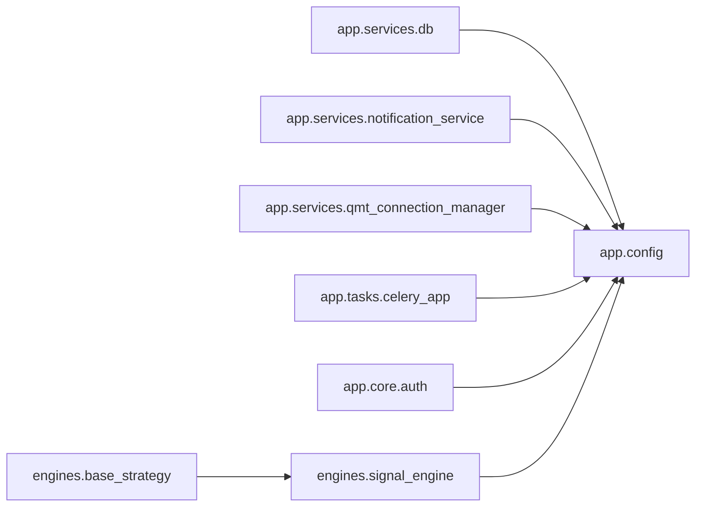

# QuantMind V2 System Diagram (Auto-Generated)

> **Plan v8 §VIII #28 closure** (sediment-then-implement, 反 LL-190).
> Generated by `scripts/generate_system_diagram.py` — auto-regenerate on demand.
> 反 hand-drawn diagram drift (audit found 8 处 stale on manual diagrams).

**Total modules scanned**: 350
**Total dependency edges**: 504

## §1 Top-20 Most-Imported Modules

| Rank | Module | Imports From N Modules |
|---|---|---|
| 1 | `app.config` | 43 |
| 2 | `app.services.db` | 33 |
| 3 | `backend.qm_platform._types` | 23 |
| 4 | `app.db` | 20 |
| 5 | `app.tasks.celery_app` | 18 |
| 6 | `engines.signal_engine` | 14 |
| 7 | `app.services.notification_service` | 10 |
| 8 | `engines.base_strategy` | 10 |
| 9 | `backend.qm_platform.llm` | 8 |
| 10 | `engines.backtest.config` | 7 |
| 11 | `engines.backtest_engine` | 7 |
| 12 | `app.services.qmt_connection_manager` | 6 |
| 13 | `app.data_fetcher.pipeline` | 6 |
| 14 | `app.core.auth` | 6 |
| 15 | `app.data_fetcher.contracts` | 5 |
| 16 | `backend.qm_platform.strategy.interface` | 5 |
| 17 | `engines.size_neutral` | 5 |
| 18 | `backend.qm_platform.risk.metrics.meta_alert_interface` | 5 |
| 19 | `engines.backtest.types` | 5 |
| 20 | `engines.slippage_model` | 4 |

## §2 Mermaid Diagram (Top-15 Anchors)

## §3 Module Inventory (Full)

Click to expand full module list

| Module | Classes | Top Functions | Imports |
|---|---|---|---|
| `app.api.__init__` | — | — | 0 |
| `app.api.agent` | AssistContext, ChatMessage, ChatRequest | _stub_reply, _is_ai_enabled, post_chat | 5 |
| `app.api.approval` | ApprovalActionRequest, ApprovalQueueItem, ApprovalQueueDetail | _get_db, _get_queue_item, _apply_action | 3 |
| `app.api.auth` | — | _cookie_secure_enabled, set_admin_token_cookie, clear_admin_token_cookie | 2 |
| `app.api.backtest` | BacktestRunRequest, BacktestRunResponse, BacktestStatusResponse | _get_session, _get_run_or_404, _require_completed | 2 |
| `app.api.dashboard` | — | _get_dashboard_service, dashboard_summary, dashboard_nav_series | 3 |
| `app.api.execution` | — | _get_session, get_pending_orders, get_execution_log | 2 |
| `app.api.execution_ops` | ConfirmBody, FixDriftExecuteBody | _check_rate_limit, _increment_rate, _get_session | 4 |
| `app.api.factors` | — | _get_factor_service, _default_date_range, get_factors_health | 2 |
| `app.api.health` | — | _get_health_repo, health_status, health_check_history | 3 |
| `app.api.market` | — | _get_session, get_indices, _mock_indices | 1 |
| `app.api.mining` | RunMiningRequest, RunMiningResponse, EvaluateFactorRequest | _get_mining_service, run_mining, list_mining_tasks | 2 |
| `app.api.news` | IngestRequest, IngestResponse, NewsRawSample | _build_pipeline_5_sources, _build_pipeline_rsshub_only, _build_pipeline_announcement_akshare | 5 |
| `app.api.notifications` | TestNotificationRequest | _get_repo, _get_service, list_notifications | 2 |
| `app.api.paper_trading` | — | _get_paper_trading_service, _get_position_repo, _get_trade_repo | 5 |
| `app.api.params` | UpdateParamRequest | _get_param_service, list_params, get_changelog | 2 |
| `app.api.pipeline` | ApproveRequest, RejectRequest, PipelineStatusResponse | _require_local, get_pipeline_status, list_pipeline_runs | 2 |
| `app.api.pms` | — | get_pms_positions, get_pms_history, get_pms_config | 4 |
| `app.api.portfolio` | — | _get_session, get_holdings, get_sector_distribution | 2 |
| `app.api.realtime` | — | _make_conn, _get_conn, get_portfolio | 2 |
| `app.api.remote_status` | — | _is_localhost, _check_api_key, _check_pg | 2 |
| `app.api.report` | — | _get_session, list_reports, get_quick_stats | 2 |
| `app.api.risk` | L4RecoveryRequest, L4ApproveRequest, ForceResetRequest | _get_risk_service, _parse_uuid, get_risk_state | 10 |
| `app.api.sse` | — | _stream_risk_events, _fetch_new_rows, sse_risk_events | 2 |
| `app.api.strategies` | CreateStrategyRequest, UpdateStrategyRequest, CreateVersionRequest | _get_strategy_service, list_strategies, get_strategy_detail | 2 |
| `app.api.system` | — | _query_datasource, _check_pg, _check_redis | 4 |
| `app.core.__init__` | — | — | 0 |
| `app.core.auth` | — | verify_admin_token | 1 |
| `app.core.platform_bootstrap` | — | bootstrap_platform_deps, reset_platform_deps | 5 |
| `app.core.qmt_client` | QMTClient | get_qmt_client | 1 |
| `app.core.rate_limit` | _TokenBucket, RateLimiter | _extract_client_ip, rate_limit_chat | 1 |
| `app.core.stream_bus` | _JSONEncoder, StreamBus | get_stream_bus, close_stream_bus | 1 |
| `app.core.xtquant_path` | — | ensure_xtquant_path | 0 |
| `app.services.__init__` | — | — | 4 |
| `app.services.backtest_service` | BacktestService | _dict_to_json | 3 |
| `app.services.config_loader` | — | load_config, to_backtest_config, to_signal_config | 3 |
| `app.services.dashboard_service` | DashboardService | — | 4 |
| `app.services.data_orchestrator` | StageResult, PipelineResult, SharedDataPool | — | 5 |
| `app.services.db` | _TrackedConnection | _get_dsn, get_sync_conn | 1 |
| `app.services.dingtalk_alert` | — | send_with_dedup, _upsert_dedup, _record_push_outcome | 2 |
| `app.services.dispatchers.__init__` | — | — | 0 |
| `app.services.dispatchers.dingtalk` | — | _build_sign_url, send_markdown, send_markdown_sync | 0 |
| `app.services.email_alert` | — | send_email_alert | 1 |
| `app.services.execution_service` | ExecutionResult, ExecutionService | — | 6 |
| `app.services.factor_compute_service` | — | save_daily_factors, _build_factor_lineage, compute_daily_factors | 7 |
| `app.services.factor_onboarding` | FactorOnboardingService | _compute_decay_level | 8 |
| `app.services.factor_repository` | — | load_daily_data, load_forward_returns, load_bulk_data | 4 |
| `app.services.factor_service` | FactorService | — | 1 |
| `app.services.fundamental_context_service` | FundamentalIngestStats, FundamentalContextService | — | 1 |
| `app.services.industry_utils` | — | get_industry_l1, get_industry_l2, get_industry_l1_map | 0 |
| `app.services.mining_service` | MiningService | — | 4 |
| `app.services.news.__init__` | — | — | 0 |
| `app.services.news.announcement_processor` | AnnouncementStats, AnnouncementProcessor | _infer_announcement_type | 3 |
| `app.services.news.bootstrap` | — | get_news_classifier, reset_news_classifier | 2 |
| `app.services.news.news_classifier_service` | PromptLoadError, ClassificationParseError, ClassificationResult | _strip_code_fence, _to_decimal | 2 |
| `app.services.news.news_ingestion_service` | IngestionStats, NewsIngestionService | — | 2 |
| `app.services.notification_service` | NotificationRepository, NotificationService, _SyncNotificationFacade | send_alert, get_notification_service, send_daily_report | 5 |
| `app.services.notification_templates` | NotificationTemplate | get_template | 0 |
| `app.services.notification_throttler` | NotificationThrottler | — | 0 |
| `app.services.paper_trading_service` | PaperTradingService, _FillProxy | — | 3 |
| `app.services.param_defaults` | ParamType, ParamModule, ParamDef | _register, get_param_def, get_all_param_defs | 0 |
| `app.services.param_service` | ParamValidationError, ParamService | — | 2 |
| `app.services.pms_engine` | PMSLevel, SellSignal, PMSEngine | _to_qmt_code, _from_qmt_code, get_pms_levels | 1 |
| `app.services.price_utils` | — | _get_sync_conn, get_adj_prices, get_latest_adj_factors | 1 |
| `app.services.pt_data_service` | — | fetch_daily_data, update_stock_status_daily, _incremental_from_previous | 4 |
| `app.services.pt_monitor_service` | — | check_opening_gap | 2 |
| `app.services.pt_qmt_state` | QMTEmptyPositionsError | _assert_positions_not_evaporated, save_qmt_state, _save_qmt_state_impl | 1 |
| `app.services.qmt_connection_manager` | QMTConnectionManager | — | 2 |
| `app.services.qmt_reconciliation_service` | ReconciliationResult, QMTReconciliationService | — | 2 |
| `app.services.realtime_data_service` | RealtimeDataService | _get_cached, _ensure_xtquant_path, _to_qmt_code | 2 |
| `app.services.risk.__init__` | — | — | 3 |
| `app.services.risk.dingtalk_webhook_service` | WebhookOutcome, DingTalkWebhookResult, DingTalkWebhookService | — | 2 |
| `app.services.risk.market_indicators_query` | — | query_limit_down_count, query_index_return | 0 |
| `app.services.risk.market_regime_service` | _RouterProtocol, MarketRegimeService | — | 3 |
| `app.services.risk.meta_monitor_service` | MetaMonitorService | — | 7 |
| `app.services.risk.qmt_sell_adapter` | QMTSellAdapter | is_paper_mode_or_disabled | 2 |
| `app.services.risk.reflection_candidate_service` | CandidateOutcome, ReflectionCandidateError, CandidateDecisionResult | _parse_candidate_id, _resolve_report_path, _extract_candidate_text | 1 |
| `app.services.risk.risk_memory_rag` | RiskMemoryRAG | — | 4 |
| `app.services.risk.risk_reflector_agent` | RiskReflectorAgent | _compose_lesson_text, _compose_context_snapshot | 5 |
| `app.services.risk.staged_execution_service` | StagedExecutionOutcome, StagedExecutionServiceResult, StagedExecutionService | build_default_broker_call, get_default_service | 6 |
| `app.services.risk_control_service` | CircuitBreakerLevel, TransitionType, CircuitBreakerState | _make_default_state, _db_state_to_dataclass, _metrics_to_dict | 3 |
| `app.services.risk_wiring` | LoggingSellBroker, DingTalkRiskNotifier, IntradayAlertDedup | build_pms_thresholds, build_risk_engine, _load_prev_close_nav | 12 |
| `app.services.shadow_portfolio` | — | _ensure_shadow_portfolio_table, _select_fold_model, _get_lgbm_scored_universe | 4 |
| `app.services.signal_service` | SignalResult, SignalService | — | 10 |
| `app.services.startup_assertions` | NamespaceMismatchError | fetch_recent_position_modes, assert_execution_mode_consistency, run_startup_assertions | 1 |
| `app.services.strategy_bootstrap` | — | get_live_strategies_for_risk_check | 5 |
| `app.services.strategy_service` | StrategyService | — | 2 |
| `app.services.t0_19_audit` | — | _collect_chat_authorization, _check_idempotency, _parse_emergency_close_log | 2 |
| `app.services.trading_calendar` | — | is_trading_day, get_next_trading_day, get_prev_trading_day | 1 |
| `app.services.v3_cutover_adapter` | — | check_v3_circuit_breaker | 1 |
| `app.tasks.__init__` | — | — | 0 |
| `app.tasks.announcement_ingest_tasks` | — | announcement_ingest | 5 |
| `app.tasks.backtest_tasks` | — | run_backtest, _run_async, _load_prices | 2 |
| `app.tasks.beat_schedule` | — | — | 0 |
| `app.tasks.celery_app` | — | — | 3 |
| `app.tasks.daily_metrics_extract_tasks` | — | _today_shanghai, extract_daily_metrics | 4 |
| `app.tasks.daily_pipeline` | — | _get_redis_client, _health_check_key, _write_scheduler_log_safe | 13 |
| `app.tasks.dynamic_threshold_tasks` | — | _get_engine, _get_cache, _build_market_indicators | 7 |
| `app.tasks.fundamental_ingest_tasks` | — | fundamental_context_ingest | 5 |
| `app.tasks.l4_sweep_tasks` | — | sweep_pending_confirm_plans, _sweep_inner, _emit_broker_plan_stuck_meta_alert | 7 |
| `app.tasks.llm_cost_audit_tasks` | — | monthly_audit | 1 |
| `app.tasks.market_regime_tasks` | — | _get_service, _get_provider, classify_market_regime | 8 |
| `app.tasks.meta_monitor_tasks` | — | _get_service, meta_monitor_tick | 3 |
| `app.tasks.mining_tasks` | — | _generate_run_id, run_gp_mining, _run_gp_mining_async | 3 |
| `app.tasks.news_ingest_tasks` | — | _persist_news_run_stats, news_ingest_5_sources, news_ingest_rsshub | 7 |
| `app.tasks.onboarding_tasks` | — | onboard_factor | 2 |
| `app.tasks.outbox_publisher` | OutboxPublisher | outbox_publisher_tick | 3 |
| `app.tasks.risk_reflector_tasks` | — | _get_rag, _get_service, _build_reflection_input | 11 |
| `app.tasks.slippage_calibration_tasks` | — | quarterly_recalibrate | 1 |
| `engines.__init__` | — | — | 0 |
| `engines.alpha158_factors` | — | _vwap, _slope, _rsquare | 0 |
| `engines.attribution` | BrinsonResult, BrinsonAttribution, MarketStateDetector | — | 0 |
| `engines.backtest.__init__` | — | — | 7 |
| `engines.backtest.broker` | SimBroker | — | 5 |
| `engines.backtest.config` | PMSConfig, BacktestConfig | — | 1 |
| `engines.backtest.engine` | SimpleBacktester, _PriceIdx | — | 4 |
| `engines.backtest.executor` | BaseExecutor, SimpleExecutor | — | 2 |
| `engines.backtest.runner` | — | _build_factor_date_index, _find_latest_factor_date, run_hybrid_backtest | 8 |
| `engines.backtest.types` | Fill, CorporateAction, PendingOrder | — | 2 |
| `engines.backtest.validators` | BaseValidator, SuspensionValidator, DataCompletenessValidator | _infer_price_limit, _get_price_limit | 0 |
| `engines.backtest_engine` | — | — | 1 |
| `engines.base_broker` | BaseBroker | get_broker | 3 |
| `engines.base_strategy` | SignalType, WeightMethod, RebalanceFreq | — | 1 |
| `engines.beta_hedge` | — | calc_portfolio_beta, apply_beta_hedge, hedge_returns | 0 |
| `engines.broker_qmt` | _QMTCallback, MiniQMTBroker, _Callback | _asset_to_dict, _position_to_dict, _order_to_dict | 3 |
| `engines.config_guard` | — | print_config_header, assert_baseline_config, _values_equal | 4 |
| `engines.datafeed` | DataFeedValidationError, DataFeed | — | 1 |
| `engines.dsr` | — | _sharpe_std, _expected_max_sharpe, deflated_sharpe_ratio | 0 |
| `engines.event_backtest_engine` | EventBacktestConfig, EventFill, Position | generate_event_report | 0 |
| `engines.factor_analyzer` | FactorAnalyzer | — | 0 |
| `engines.factor_classifier` | FactorSignalType, SelectionMethod, WeightingScheme | classify_v11_factors | 1 |
| `engines.factor_decay` | DecayLevel, DecayResult | classify_decay_level, calc_consecutive_low_ic_days, check_factor_decay | 0 |
| `engines.factor_engine.__init__` | — | calc_pead_q1 | 8 |
| `engines.factor_engine._constants` | — | — | 0 |
| `engines.factor_engine.alpha158` | — | _alpha158_rolling, calc_high_vol_price_ratio_wide, calc_alpha158_simple_four | 1 |
| `engines.factor_engine.calculators` | — | calc_momentum, calc_reversal, calc_volatility | 0 |
| `engines.factor_engine.pead` | — | calc_pead_q1_from_announcements | 0 |
| `engines.factor_engine.preprocess` | — | preprocess_mad, preprocess_fill, preprocess_neutralize | 0 |
| `engines.factor_gate` | GateStatus, GateResult, GateReport | — | 1 |
| `engines.factor_lifecycle` | FactorStatus, TransitionDecision, DualPathComparison | evaluate_transition, count_days_below_critical, _old_path_label | 1 |
| `engines.factor_profile` | FactorProfile, FactorProfilePipeline | fit_exponential_decay, recommend_freq | 0 |
| `engines.factor_profiler` | — | _get_conn, _f, _load_shared_data | 3 |
| `engines.factor_timing` | — | calc_timing_score, calc_timing_weights, compare_timing_vs_equal | 1 |
| `engines.fast_neutralize` | — | _mad_winsorize, _wls_neutralize, _zscore_clip | 2 |
| `engines.financial_factors` | — | load_financial_pit, calc_roe_change_q, calc_revenue_accel | 0 |
| `engines.ic_calculator` | — | compute_forward_excess_returns, compute_daily_rank_ic, compute_ic_series | 0 |
| `engines.metrics` | PerformanceReport | deflated_sharpe_ratio, calc_max_dd_duration, calc_excess_max_drawdown | 1 |
| `engines.mining.__init__` | — | — | 0 |
| `engines.mining.agents.__init__` | — | — | 0 |
| `engines.mining.agents.eval_agent` | EvalResult, EvalAgent | — | 0 |
| `engines.mining.agents.factor_agent` | GeneratedFactorCode, FactorAgent | — | 0 |
| `engines.mining.agents.idea_agent` | ActiveFactor, FailedFactor, FactorHypothesis | — | 0 |
| `engines.mining.ast_dedup` | DedupResult, _ASTNormalizer, ASTDeduplicator | _eval_constant_binop | 0 |
| `engines.mining.bruteforce_engine` | FactorTemplate, FactorCandidate, BruteForceEngine | — | 0 |
| `engines.mining.deepseek_client` | TaskType, LLMMessage, LLMResponse | get_default_client, get_default_router | 0 |
| `engines.mining.engine_selector` | EngineStats, SelectionResult, ThompsonSamplingSelector | — | 0 |
| `engines.mining.factor_dsl` | OpType, DimType, ExprNode | infer_dimension, check_dimensional_validity, _eval_node | 0 |
| `engines.mining.factor_sandbox` | ValidationResult, ExecutionResult, _ASTSecurityVisitor | _subprocess_worker, _build_safe_namespace, _ts_mean | 0 |
| `engines.mining.gp_engine` | GPConfig, GPResult, GPRunStats | save_run_results, add_blacklist_to_results_file, load_previous_results | 1 |
| `engines.mining.pipeline_orchestrator` | PipelineNode, NodeStatus, RunStatus | _is_failed, _extract_factor_series, _extract_fwd_series | 4 |
| `engines.mining.pipeline_utils` | — | load_market_data, load_existing_factor_data, compute_forward_returns | 3 |
| `engines.mining.quick_backtester` | QuickBacktestResult, QuickBacktester | _get_prev_close, _calc_sharpe, _calc_mdd | 0 |
| `engines.minute_feature_engine` | — | compute_daily_minute_features, _calc_high_freq_volatility, _calc_volume_concentration | 1 |
| `engines.ml_engine` | MLConfig, Fold, FoldResult | _get_db_conn, _add_months, _snap_to_trade_date | 1 |
| `engines.ml_explainer` | FeatureImportance, PredictionBreakdown, TemporalStability | — | 0 |
| `engines.modifiers.__init__` | — | — | 2 |
| `engines.modifiers.base` | ModifierResult, ModifierBase | — | 1 |
| `engines.modifiers.northbound_modifier` | NorthboundModifier | — | 2 |
| `engines.modifiers.regime_modifier` | RegimeModifier | — | 4 |
| `engines.multi_freq_backtest` | FreqBacktestResult, MultiFreqComparison, MultiFreqBacktestRunner | — | 3 |
| `engines.neutralizer` | FactorNeutralizer | — | 0 |
| `engines.paper_broker` | PaperState, PaperBroker | — | 2 |
| `engines.pbo` | — | probability_of_backtest_overfitting, interpret_pbo | 0 |
| `engines.portfolio_aggregator` | AggregatedPortfolio, PortfolioAggregator | — | 0 |
| `engines.portfolio_network` | PortfolioLayer, PortfolioMLP, TrainerConfig | sharpe_loss, compute_period_returns | 0 |
| `engines.pre_trade_validator` | ValidationResult, PreTradeValidator | — | 0 |
| `engines.qlib_adapter` | QuantMindQlibAdapter | — | 0 |
| `engines.qmt_execution_adapter` | _OrderRecord, OrderTracker, _WaitTracker | is_final_status, _get_realtime_tick, _to_qmt_code | 1 |
| `engines.regime_detector` | RegimeResult, HMMRegimeDetector | _compute_features, _map_states, _probs_to_scale | 1 |
| `engines.signal_engine` | SignalConfig, SignalComposer, PortfolioBuilder | init_platform_dependencies, _get_direction, _load_pt_yaml_strategy | 3 |
| `engines.size_neutral` | — | load_ln_mcap_pivot, load_ln_mcap_for_date, apply_size_neutral | 1 |
| `engines.slippage_model` | SlippageResult, SlippageConfig | overnight_gap_cost, volume_impact_slippage, estimate_execution_price | 0 |
| `engines.strategies.__init__` | — | — | 4 |
| `engines.strategies.composite` | CompositeDecision, CompositeStrategy | — | 3 |
| `engines.strategies.equal_weight` | EqualWeightStrategy | — | 2 |
| `engines.strategies.event_strategy` | EventType, TradingEvent, EventStrategy | — | 1 |
| `engines.strategies.fast_ranking` | FastRankingStrategy | — | 2 |
| `engines.strategies.multi_freq` | MultiFreqStrategy | — | 2 |
| `engines.strategies.s1_monthly_ranking` | S1MonthlyRanking | get_s1_factor_pool | 4 |
| `engines.strategies.s2_pead_event` | S2PEADConfig, S2PEADEvent | — | 2 |
| `engines.strategy_registry` | StrategyRegistry | _register_builtin_strategies | 3 |
| `engines.trading_day_checker` | TradingDayChecker | — | 2 |
| `engines.vectorized_signal` | SignalConfig | compute_rebalance_dates, build_target_portfolios | 0 |
| `engines.vol_regime` | — | calc_vol_regime, calc_baseline_vol | 0 |
| `engines.walk_forward` | WFConfig, WFFoldResult, WFResult | build_exclusion_map, make_equal_weight_signal_func, print_wf_report | 5 |
| `qm_platform.__init__` | — | — | 0 |
| `qm_platform._types` | Signal, Order, Verdict | — | 0 |
| `qm_platform.backtest.__init__` | — | — | 0 |
| `qm_platform.backtest.executor` | SerialBacktestExecutor | — | 1 |
| `qm_platform.backtest.interface` | UniverseFilter, SlippageConfig, PMSConfig | — | 0 |
| `qm_platform.backtest.loaders` | ParquetBaselineLoader, BacktestCacheLoader | — | 0 |
| `qm_platform.backtest.memory_registry` | InMemoryBacktestRegistry | — | 1 |
| `qm_platform.backtest.registry` | DBBacktestRegistry | _f, _i | 3 |
| `qm_platform.backtest.runner` | PlatformBacktestRunner | — | 5 |
| `qm_platform.backup.__init__` | — | — | 0 |
| `qm_platform.backup.interface` | BackupResult, RestoreResult, BackupManager | — | 0 |
| `qm_platform.calendar.__init__` | — | get_calendar, reset_calendar, parse_pt_start_date | 0 |
| `qm_platform.calendar.provider` | CalendarProvider | — | 2 |
| `qm_platform.ci.__init__` | — | — | 0 |
| `qm_platform.ci.interface` | TestSummary, TestRunner, CoverageGate | — | 0 |
| `qm_platform.config.__init__` | — | — | 0 |
| `qm_platform.config.auditor` | _TripleField, ConfigDriftError, ConfigDriftReport | _values_equal, _get_dotted, _cast_env | 1 |
| `qm_platform.config.feature_flag` | _DBConnection, FlagNotFound, FlagExpired | _conn_cursor | 0 |
| `qm_platform.config.interface` | ConfigDriftReport, ConfigSchema, ConfigLoader | — | 0 |
| `qm_platform.config.loader` | PlatformConfigLoader | _resolve_yaml_path, _load_yaml, _transform_yaml_for_schema | 0 |
| `qm_platform.config.schema` | StrategyConfigSchema, SlippageConfigSchema, CostConfigSchema | — | 0 |
| `qm_platform.data.__init__` | — | — | 0 |
| `qm_platform.data.access_layer` | DALError, UnsupportedColumn, UnsupportedField | _conn_cursor, _as_list, _coerce_date | 0 |
| `qm_platform.data.base_source` | ContractViolation, BaseDataSource | — | 0 |
| `qm_platform.data.cache_coherency` | CacheCoherencyError, CacheCoherencyPolicy, MaxDateChecker | check_stale | 0 |
| `qm_platform.data.fundamental.__init__` | — | — | 0 |
| `qm_platform.data.fundamental.akshare_valuation` | FundamentalFetchError, ValuationContext, AkshareValuationFetcher | _safe_float | 0 |
| `qm_platform.data.interface` | DataContract, ValidationResult, DataSource | — | 0 |
| `qm_platform.data.lineage` | LineageRef, CodeRef, Lineage | _to_jsonable, lineage_to_jsonable, lineage_from_jsonable | 0 |
| `qm_platform.data.sources.__init__` | — | — | 0 |
| `qm_platform.data.sources.baostock_source` | BaostockDataSource | _to_bs_code, _to_db_code | 0 |
| `qm_platform.data.sources.qmt_source` | QMTDataSource | _tick_attr | 0 |
| `qm_platform.data.sources.tushare_source` | TushareDataSource | _board_from_ts_code | 0 |
| `qm_platform.eval.__init__` | — | — | 0 |
| `qm_platform.eval.gates.__init__` | — | — | 0 |
| `qm_platform.eval.gates.base` | GateError, GateContext, Gate | — | 0 |
| `qm_platform.eval.gates.g10_hypothesis` | G10HypothesisGate | — | 0 |
| `qm_platform.eval.gates.g1_ic_significance` | G1IcSignificanceGate | — | 0 |
| `qm_platform.eval.gates.g2_corr_filter` | G2CorrelationFilterGate | — | 0 |
| `qm_platform.eval.gates.g3_paired_bootstrap` | G3PairedBootstrapGate | — | 0 |
| `qm_platform.eval.gates.g4_oos_walkforward` | G4WalkForwardGate | — | 0 |
| `qm_platform.eval.gates.g8_bh_fdr` | G8BhFdrGate | — | 0 |
| `qm_platform.eval.gates.g9_novelty_ast` | G9NoveltyAstGate | — | 0 |
| `qm_platform.eval.interface` | GateResult, EvaluationPipeline, StrategyEvaluator | — | 0 |
| `qm_platform.eval.pipeline` | EvaluationDecision, EvaluationReport, PlatformEvaluationPipeline | _json_safe, _classify_decision | 0 |
| `qm_platform.eval.strategy_evaluator` | PlatformStrategyEvaluator | build_strategy_context | 0 |
| `qm_platform.eval.strategy_gates` | StrategyG1SharpeGate, StrategyG2MaxDrawdownGate, StrategyG3RegressionGate | _compute_max_drawdown, default_strategy_pipeline | 0 |
| `qm_platform.eval.utils` | — | paired_bootstrap_pvalue, t_statistic, benjamini_hochberg_threshold | 0 |
| `qm_platform.factor.__init__` | — | — | 0 |
| `qm_platform.factor.interface` | FactorStatus, FactorSpec, FactorMeta | — | 0 |
| `qm_platform.factor.lifecycle` | PlatformLifecycleMonitor | count_days_below_critical, evaluate_transition | 0 |
| `qm_platform.factor.registry` | OnboardingBlocked, DuplicateFactor, FactorNotFound | _default_ast_jaccard, _row_to_factor_meta, _float_or_none | 0 |
| `qm_platform.knowledge.__init__` | — | — | 0 |
| `qm_platform.knowledge.interface` | ExperimentRecord, FailedDirectionRecord, ADRRecord | — | 0 |
| `qm_platform.knowledge.registry` | KnowledgeError, ExperimentNotFound, ADRNotFound | _extract_keywords, _json_dumps, _json_loads | 0 |
| `qm_platform.llm.__init__` | — | — | 0 |
| `qm_platform.llm._internal.__init__` | — | — | 0 |
| `qm_platform.llm._internal.audit` | LLMCallRecord, LLMCallLogger | _conn_cursor, compute_prompt_hash | 0 |
| `qm_platform.llm._internal.budget` | BudgetState, BudgetExceededError, BudgetSnapshot | _conn_cursor | 0 |
| `qm_platform.llm._internal.router` | LiteLLMRouter, FallbackDetectionError | _propagate_settings_to_environ, _lookup_pricing, _lookup_cache_hit_rate | 1 |
| `qm_platform.llm.bootstrap` | — | get_llm_router, reset_llm_router | 1 |
| `qm_platform.llm.types` | RiskTaskType, LLMMessage, LLMResponse | — | 0 |
| `qm_platform.news.__init__` | — | — | 0 |
| `qm_platform.news.akshare_cninfo` | AkshareCninfoFetcher | _format_date | 0 |
| `qm_platform.news.announcement_routes` | — | validate_source, build_announcement_route | 0 |
| `qm_platform.news.anspire` | _AnspireRetryableError, AnspireNewsFetcher | _clamp_top_k, _parse_timestamp | 0 |
| `qm_platform.news.base` | NewsFetchError, NewsItem, NewsFetcher | — | 0 |
| `qm_platform.news.gdelt` | _GdeltRetryableError, GdeltNewsFetcher | _parse_seendate | 0 |
| `qm_platform.news.marketaux` | _MarketauxRetryableError, MarketauxNewsFetcher | _parse_published_at | 0 |
| `qm_platform.news.pipeline` | DataPipeline | — | 0 |
| `qm_platform.news.rsshub` | _RsshubRetryableError, RsshubNewsFetcher | _parse_feed_timestamp | 0 |
| `qm_platform.news.tavily` | _TavilyRetryableError, TavilyNewsFetcher | _parse_timestamp | 0 |
| `qm_platform.news.zhipu` | _ZhipuRetryableError, ZhipuNewsFetcher | _parse_timestamp | 0 |
| `qm_platform.observability.__init__` | — | — | 0 |
| `qm_platform.observability.alert` | AlertDispatchError, Channel, DingTalkChannel | _now_utc, get_alert_router, reset_alert_router | 3 |
| `qm_platform.observability.health` | HealthReport | safe_check, aggregate_status | 0 |
| `qm_platform.observability.interface` | Metric, Alert, MetricExporter | — | 0 |
| `qm_platform.observability.metric` | MetricExportError, PostgresMetricExporter | _now_utc, get_metric_exporter, reset_metric_exporter | 1 |
| `qm_platform.observability.outbox` | OutboxWriter | — | 0 |
| `qm_platform.observability.rules` | AlertRuleError, AlertRule, AlertRulesEngine | — | 0 |
| `qm_platform.resource.__init__` | — | — | 0 |
| `qm_platform.resource.interface` | AdmissionResult, ResourceSnapshot, ResourceManager | requires_resources | 0 |
| `qm_platform.risk.__init__` | — | — | 0 |
| `qm_platform.risk.backtest_adapter` | RiskBacktestAdapter | — | 0 |
| `qm_platform.risk.dynamic_threshold.__init__` | — | — | 0 |
| `qm_platform.risk.dynamic_threshold.cache` | ThresholdCache, InMemoryThresholdCache, RedisThresholdCache | — | 0 |
| `qm_platform.risk.dynamic_threshold.engine` | MarketState, MarketIndicators, StockMetrics | — | 0 |
| `qm_platform.risk.engine` | BrokerProtocol, NotifierProtocol, PriceReaderProtocol | _root_rule_id_via_rules | 1 |
| `qm_platform.risk.execution.__init__` | — | — | 0 |
| `qm_platform.risk.execution.batched_planner` | BatchedPositionInput | compute_batch_count, _priority_key, _split_qty | 0 |
| `qm_platform.risk.execution.broker_executor` | BrokerExecutionResult | execute_plan_sell | 0 |
| `qm_platform.risk.execution.planner` | ExecutionMode, PlanStatus, ExecutionPlan | — | 0 |
| `qm_platform.risk.execution.reentry_tracker` | SoldRecord, ReentryCheckResult, ReentryTracker | format_reentry_notification | 0 |
| `qm_platform.risk.execution.webhook_parser` | WebhookCommand, CandidateCommand, WebhookParseErrorCode | verify_signature, parse_command, parse_candidate_command | 0 |
| `qm_platform.risk.interface` | Position, RiskContext, RuleResult | — | 1 |
| `qm_platform.risk.memory.__init__` | — | — | 0 |
| `qm_platform.risk.memory.embedding_service` | EmbeddingService, BGEM3EmbeddingService | _resolve_default_cache_folder | 0 |
| `qm_platform.risk.memory.interface` | ActionTaken, RiskMemoryError, RiskMemoryOutcome | — | 0 |
| `qm_platform.risk.memory.repository` | — | _embedding_to_pgvector_str, persist_risk_memory, retrieve_similar | 0 |
| `qm_platform.risk.memory.retention` | RetentionTier, RetentionPolicy | classify_tier, threshold_for_tier, filter_by_retention | 0 |
| `qm_platform.risk.metrics.__init__` | — | — | 4 |
| `qm_platform.risk.metrics.daily_aggregator` | DailyMetricsSpec, DailyMetricsResult | aggregate_daily_metrics, upsert_daily_metrics, _run_query_safe | 0 |
| `qm_platform.risk.metrics.meta_alert_interface` | MetaAlertSeverity, MetaAlertRuleId, MetaAlertError | _require_tz_aware | 0 |
| `qm_platform.risk.metrics.meta_alert_rules` | — | evaluate_l1_heartbeat, evaluate_litellm_failure_rate, evaluate_dingtalk_push | 0 |
| `qm_platform.risk.metrics.verify_report` | AcceptanceItem, AcceptanceReport | generate_verify_report, _load_window_rows, _count_staged_failed | 0 |
| `qm_platform.risk.realtime.__init__` | — | — | 0 |
| `qm_platform.risk.realtime.alert` | AlertDispatcher | _rule_severity_str | 0 |
| `qm_platform.risk.realtime.email_backup` | EmailBackupStub | — | 0 |
| `qm_platform.risk.realtime.engine` | RealtimeRiskEngine | — | 0 |
| `qm_platform.risk.realtime.rule_registry` | — | register_all_realtime_rules | 0 |
| `qm_platform.risk.realtime.runtime_keys` | — | — | 0 |
| `qm_platform.risk.realtime.subscriber` | XtQuantTickSubscriber | — | 0 |
| `qm_platform.risk.reflector.__init__` | — | — | 0 |
| `qm_platform.risk.reflector.agent` | _RouterProtocol, PromptLoadError, ReflectorAgent | _strip_code_fence, _load_prompt, _parse_reflection_response | 1 |
| `qm_platform.risk.reflector.interface` | ReflectionDimension, ReflectorAgentError, ReflectionInput | — | 0 |
| `qm_platform.risk.regime.__init__` | — | — | 0 |
| `qm_platform.risk.regime.agents` | _RouterProtocol, PromptLoadError, _ArgumentsAgent | _strip_code_fence, _load_prompt, _parse_json_response | 1 |
| `qm_platform.risk.regime.default_indicators_provider` | DefaultIndicatorsProvider | _is_nan | 2 |
| `qm_platform.risk.regime.indicators_provider` | IndicatorsProvider, StubIndicatorsProvider | — | 0 |
| `qm_platform.risk.regime.interface` | RegimeLabel, MarketRegimeError, RegimeArgument | — | 0 |
| `qm_platform.risk.regime.repository` | — | persist_market_regime | 0 |
| `qm_platform.risk.replay.__init__` | — | — | 0 |
| `qm_platform.risk.replay.acceptance` | FalsePositiveClassification, StagedClosureResult, AcceptanceItem | classify_false_positives, evaluate_staged_closure, latency_percentile | 0 |
| `qm_platform.risk.replay.counterfactual` | EventSummary | summarize_events | 0 |
| `qm_platform.risk.replay.runner` | ReplayWindow, ReplayRunResult, ReplayRunner | — | 0 |
| `qm_platform.risk.rules.__init__` | — | — | 0 |
| `qm_platform.risk.rules.circuit_breaker` | CircuitBreakerRule | — | 2 |
| `qm_platform.risk.rules.holding_time` | PositionHoldingTimeRule | — | 1 |
| `qm_platform.risk.rules.intraday` | QMTConnectionReader, IntradayPortfolioDropRule, IntradayPortfolioDrop3PctRule | — | 1 |
| `qm_platform.risk.rules.new_position` | NewPositionVolatilityRule | — | 1 |
| `qm_platform.risk.rules.pms` | PMSThreshold, PMSRule | — | 1 |
| `qm_platform.risk.rules.qmt_fallback` | RedisCacheHealthReader, QMTFallbackTriggeredRule | — | 1 |
| `qm_platform.risk.rules.realtime.__init__` | — | — | 0 |
| `qm_platform.risk.rules.realtime.correlated_drop` | CorrelatedDrop | — | 1 |
| `qm_platform.risk.rules.realtime.gap_down` | GapDownOpen | — | 1 |
| `qm_platform.risk.rules.realtime.industry_concentration` | IndustryConcentration | — | 1 |
| `qm_platform.risk.rules.realtime.limit_down` | LimitDownDetection, NearLimitDown | _is_star_or_kcb | 1 |
| `qm_platform.risk.rules.realtime.liquidity_collapse` | LiquidityCollapse | — | 1 |
| `qm_platform.risk.rules.realtime.rapid_drop` | RapidDrop5min, RapidDrop15min | — | 1 |
| `qm_platform.risk.rules.realtime.trailing_stop` | _TrailState, TrailingStop | — | 1 |
| `qm_platform.risk.rules.realtime.volume_spike` | VolumeSpike | — | 1 |
| `qm_platform.risk.rules.single_stock` | StopLossThreshold, SingleStockStopLossRule | — | 1 |
| `qm_platform.risk.sources.__init__` | — | — | 0 |
| `qm_platform.risk.sources._enricher` | PriceReader | load_entry_prices, _resolve_entry_date, load_entry_dates | 0 |
| `qm_platform.risk.sources.db_snapshot` | DBPositionSource | — | 0 |
| `qm_platform.risk.sources.qmt_realtime` | PositionReader, QMTPositionSource | — | 0 |
| `qm_platform.signal.__init__` | — | — | 0 |
| `qm_platform.signal.audit` | AuditMissing, StubExecutionAuditTrail, OutboxBackedAuditTrail | — | 2 |
| `qm_platform.signal.interface` | AuditChain, SignalPipeline, OrderRouter | — | 0 |
| `qm_platform.signal.pipeline` | FactorStaleError, UniverseEmpty, PlatformSignalPipeline | — | 5 |
| `qm_platform.signal.router` | IdempotencyViolation, InsufficientCapital, TurnoverCapExceeded | — | 0 |
| `qm_platform.strategy.__init__` | — | — | 0 |
| `qm_platform.strategy.allocator` | EqualWeightAllocator | — | 0 |
| `qm_platform.strategy.interface` | RebalanceFreq, StrategyStatus, StrategyContext | — | 0 |
| `qm_platform.strategy.registry` | StrategyNotFound, StrategyRegistryIntegrityError, EvaluationRequired | — | 0 |

---

**Auto-regenerate**: `python scripts/generate_system_diagram.py`
**Source of truth**: AST parse of backend/app + qm_platform + engines
**Plan v8 §VIII #28 closure**: 2026-05-20 Day 1 morning sediment